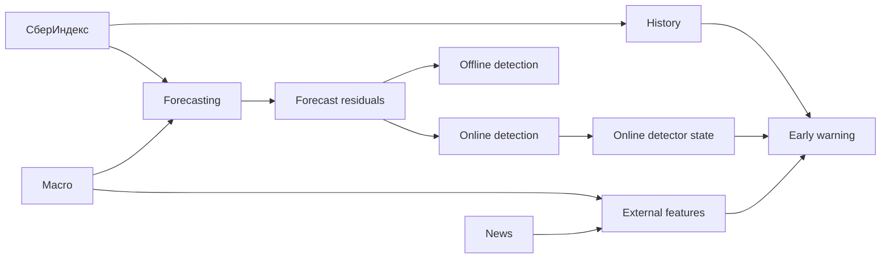
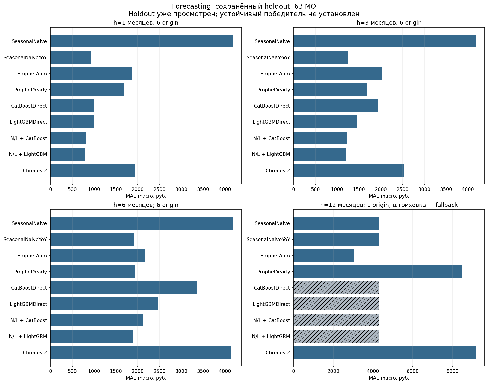
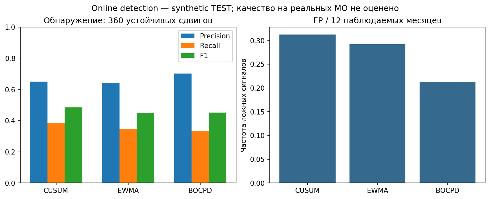
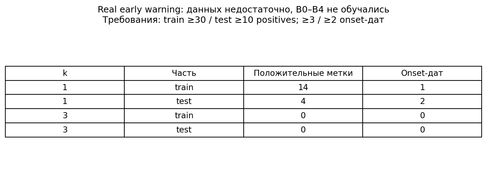
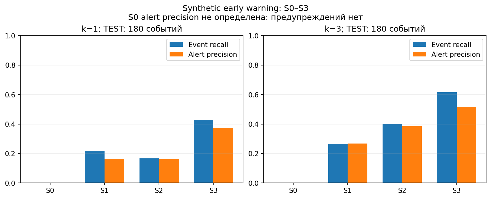

# Прогнозирование потребительских расходов и обнаружение структурных изменений

Данные СберИндекса по муниципальным образованиям (МО), месячные прогнозы на **1, 3, 6 и 12 месяцев**.<br>
Проект объединяет forecasting, обнаружение структурных изменений и проверку возможности early warning.<br>
Результаты на реальных данных и controlled synthetic benchmarks представлены отдельно.

[Результаты](#результаты) · [Архитектура](#архитектура) · [Воспроизведение](#воспроизведение) · [Ограничения](#ограничения)

[Методологический отчёт](reports/final/METHODOLOGY_REPORT.md) · [Презентация PDF](reports/final/presentation/presentation.pdf) · [Итоговая сводка](reports/final/RESULTS_SUMMARY.md) · [Ограничения](reports/final/limitations.md) · [Терминология](reports/final/terminology.md)

## Результаты

### Что получилось

- **SeasonalNaiveYoY**, прогноз по доступной к forecast origin истории, **превосходит оба проверенных Prophet на h=1/3/6** по MAE на сопоставимом pilot holdout.
- **National/Local + LightGBM:** MAE **799.6 / 1212.7 / 1897.2 руб.** на h=1/3/6. Это минимумы основной таблицы holdout; преимущество не полностью устойчиво на validation.
- **CUSUM / EWMA / BOCPD и PELT / Binary Segmentation** проверены в отдельном synthetic benchmark. Результаты на реальных МО являются диагностическими сигналами.
- **Реальной панели недостаточно для корректной оценки early-warning модели с временным разбиением.** Отдельный controlled synthetic benchmark проверяет предупреждение при наличии наблюдаемых предвестников.

Проект даёт воспроизводимый forecasting benchmark, сравнение online/offline detection и проверку достаточности данных для early warning. Результаты на real и synthetic данных и диагностические сигналы разделены.

Числа и рисунки взяты из [финальной сводки](reports/final/RESULTS_SUMMARY.md). Результаты доступны в [JSON](reports/final/results_summary.json), определения метрик — в [словаре терминов](reports/final/terminology.md). Исследовательская фаза завершена.

## Архитектура



На real data проверена достаточность данных для early warning; на synthetic количественно проверен механизм предупреждения.

Forecasting оценивает будущие расходы. Детекторы работают с ошибками SeasonalNaiveYoY: online использует текущий и прошлые месяцы, offline — весь отрезок. Early warning предупреждает **до** начала сдвига. Аномалия, обнаруженное изменение и предупреждение требуют разных меток и метрик.

В early-warning features входят история, состояния online-детекторов и внешние сведения, доступные на forecast origin. Offline-границы в них не используются.

## Данные и backtest

Данные: **январь 2023 — декабрь 2024, 24 месяца, 2190 МО, месячная частота**. Цель — категория **«Все категории»**, оценка средних безналичных расходов жителей в номинальных рублях. Единица наблюдения — МО × месяц; это не совокупный оборот муниципалитета.

Прогнозное сравнение с Prophet — пилот: **64 выбранных МО, 63 с пригодными `y_true`**. Одно МО исключено из оценки из-за отсутствия фактов. Полная панель используется для проверки early warning; число МО не увеличивает число независимых календарных дат.

В rolling-origin backtest дата выпуска сдвигается по календарю. Модель обучается и строит признаки по доступной истории; прогноз сравнивается с фактом через 1, 3, 6 или 12 месяцев. Validation включает цели до июня 2024, holdout — июль–декабрь 2024. Для h=1/3/6 holdout содержит по 6 origin, **для h=12 — одну**.

Модели сравниваются на одинаковых ключах МО × origin × target month × horizon, с учётом ошибок и fallback. Пропущенные факты не заменяются нулями. **Holdout уже просмотрен:** последующие сравнения не являются новой независимой проверкой. Доступность истории зависит от допущений о датах публикации.

## Прогнозирование расходов

Основная метрика — **MAE macro в исходных рублях**: средняя абсолютная ошибка каждого МО усредняется с равными весами. Меньше — лучше. MAE micro, pooled R², coverage и числа прогнозов без/с fallback доступны в [forecasting_metrics.csv](reports/final/forecasting_metrics.csv). Pooled R² не заменяет проверку динамики отдельных МО.

**Реальные данные: pilot holdout, цели июля–декабря 2024.** Все значения округлены непосредственно из финального CSV до одного десятичного знака.

| Модель | 1 мес. | 3 мес. | 6 мес. | 12 мес. |
| --- | ---: | ---: | ---: | ---: |
| SeasonalNaive | 4175.1 | 4175.1 | 4175.1 | 4322.1 |
| SeasonalNaiveYoY | 920.7 | 1240.4 | 1906.0 | 4322.1 |
| ProphetAuto | 1868.6 | 2041.3 | 2165.8 | 3054.2 |
| ProphetYearly | 1682.3 | 1679.6 | 1937.6 | 8496.0 |
| CatBoostDirect | 986.2 | 1939.2 | 3349.5 | 4322.1† |
| LightGBMDirect | 1003.3 | 1449.8 | 2463.2 | 4322.1† |
| National/Local + CatBoost | 823.4 | 1225.7 | 2132.7 | 4322.1† |
| National/Local + LightGBM | **799.6** | **1212.7** | **1897.2** | 4322.1† |
| Chronos-2 | 1947.4 | 2526.3 | 4150.6 | 9163.5 |

**† — SeasonalNaive fallback.** На годовой origin отсутствуют годовые training pairs для direct boosting и обоих National/Local learners. Их h=12 отражает резервную стратегию. Выпуск декабрь 2023 → декабрь 2024 единственный; validation для этого горизонта отсутствует. Устойчивый ranking h=12 установить невозможно.

1. SeasonalNaiveYoY — сильный baseline: его holdout MAE ниже обоих Prophet на h=1/3/6. Оценка относится к проверенным вариантам Prophet на общей пилотной выборке.
2. National/Local decomposition улучшает boosting-модели на части горизонтов. Национальная медиана прогнозируется SeasonalNaiveYoY, локальная модель оценивает отношение расходов МО к медиане; будущая национальная медиана в восстановлении прогноза не используется.
3. National/Local + LightGBM имеет минимальную holdout MAE **среди девяти стратегий этой таблицы** на h=1/3/6. На validation он уступает SeasonalNaiveYoY; окончательный устойчивый победитель не установлен.

Разложение меняет масштаб признаков, обучающую цель и национальный прогноз, поэтому оценивается полная стратегия. Эффект нельзя приписать только библиотеке boosting или отдельному feature. Validation и промежуточные ablations приведены в сводке и подробных отчётах. Макропризнаки проверялись в отдельной ablation; устойчивый прирост качества не установлен.

Дополнительно проверены ключевая ставка Банка России и официальный курс USD/RUB; для каждого forecast origin использовались только значения, доступные к моменту формирования прогноза. Фиксированное сравнение моделей не показало устойчивого улучшения: снижение MAE с FX наблюдалось только на h=6 и не было устойчивым по горизонтам. Для weak-event labels из E07 сравнительный early-warning эффект оценить не удалось, поскольку среди дат с известной меткой не было отрицательного класса ([подробности](reports/final/RESULTS_SUMMARY.md#leading-financial-indicators)).



### Foundation model

**Chronos-2 протестирован zero-shot**, без дообучения, на той же области прогнозного сравнения. Его MAE составляет **1947.4 / 2526.3 / 4150.6 / 9163.5 руб.** на h=1/3/6/12. Он не превзошёл сильные SeasonalNaiveYoY и National/Local boosting baselines.

Checkpoint опубликован после периода backtest. Его историческая доступность и отсутствие pretraining overlap не доказаны; оценка ретроспективная.

## Обнаружение структурных изменений

Детекторы проверены в **SYNTHETIC BENCHMARK** с известными устойчивыми положительными и отрицательными сдвигами: 360 test-событий. Они отслеживают ошибки SeasonalNaiveYoY. На реальных данных изменение ошибки само по себе не подтверждает экономический шок.

### Online detection

CUSUM, EWMA и BOCPD используют текущий и прошлые месяцы. Параметры выбирались на synthetic validation с ограничением контрольных тревог. Precision, recall и F1 относятся к сопоставленным событиям; FP/12 — несопоставленные сигналы на 12 месяцев мониторинга, включая повторные тревоги.

**Метрики таблицы — SYNTHETIC BENCHMARK.**

| Метод | Precision | Recall | F1 | FP/12 |
| --- | ---: | ---: | ---: | ---: |
| CUSUM | 0.650 | 0.386 | 0.484 | 0.312 |
| EWMA | 0.641 | 0.347 | 0.450 | 0.292 |
| BOCPD | 0.702 | 0.333 | 0.452 | 0.212 |

В этой оценке у CUSUM наибольшая F1, у BOCPD — наибольшая precision и меньше FP/12. Выбор зависит от цены пропусков и ложных тревог. Нулевая медианная задержка EWMA относится только к обнаруженным событиям; большинство событий он пропускает.

На **реальных 63 МО** получены **104 / 97 / 14 alerts** для CUSUM / EWMA / BOCPD соответственно. Это **diagnostic signals**; без независимой разметки нельзя вычислить их реальную precision или recall.



### Offline detection

PELT и Binary Segmentation сегментируют **весь отрезок**, включая данные после оцениваемой границы. Localisation error — ошибка ретроспективной границы у обнаруженных событий; она отличается от online delay и early-warning lead time.

**Метрики таблицы — SYNTHETIC BENCHMARK.**

| Метод | Precision | Recall | F1 | FP/12 | Медиана localisation error, мес. |
| --- | ---: | ---: | ---: | ---: | ---: |
| PELT | 0.449 | 0.308 | 0.366 | 0.567 | 0 |
| Binary Segmentation | 0.441 | 0.258 | 0.326 | 0.492 | 0 |

На реальных данных сохранены **81 / 79 candidate breakpoints**, включая warmup-кандидатов: это диагностика. При удлинении ряда границы пересматривались; проверка стабильности ретроспективная. Общий победитель online/offline не выбирается из-за разного доступа к будущему. Offline test повторяет просмотренную синтетику online benchmark.

Независимая проверка реализации PELT из ruptures показала: глобальный минимум целевой функции при использованных условиях не гарантирован. Метрики относятся к полученным сегментациям. Числа событий, задержки и пропуски — в [detection_metrics.csv](reports/final/detection_metrics.csv), ограничения — в сводке.

## News / events pipeline

Pipeline учитывает доступность публикаций к forecast origin, сохраняет версии, устраняет дубли, определяет географию и темы. Он формирует **26 features и 26 индикаторов пропусков**. Недоступные сведения отделяются от наблюдаемого нуля; версии и дубли не считаются независимыми событиями.

Корпус содержит **93 URL-документа, 197 сохранённых версий и 89 групп дедупликации**; признаки — **7 уникальных временных векторов**. К последней origin допущены 20 исторических URL-документов. Региональных/муниципальных исторических событий **нет**: национальные публикации, скопированные по МО, не создают независимых пространственных наблюдений.

Доступность определяется записанной политикой допуска. Доверие датированным официальным архивам — явное допущение; независимые исторические снимки не подтверждены. Полнота корпуса не подтверждена: отсутствие наблюдаемой новости не означает отсутствия события.

**News pipeline реализован и согласован по времени, но исторических публикаций недостаточно для надёжного измерения вклада news.** Улучшение реальных прогнозов или предупреждений не установлено. Корпус и макроисточники описаны в [итоговой сводке](reports/final/RESULTS_SUMMARY.md).

## Раннее предупреждение будущих изменений

Предупреждение оценивает риск начала события в следующие `k` месяцев. Сигнал после onset обнаруживает уже начавшееся изменение. До обучения проверяются доступность меток, достаточность временного разбиения и наличие предвестников в признаках.

### Реальные данные

На панели **2190 МО** найдены **73 weak events: 6 onset-дат, 71 МО**. Weak labels отмечают устойчивое изменение ошибки SeasonalNaiveYoY с трёхмесячным подтверждением. Это автоматическая разметка, а не независимые метки экономических шоков.

Для корректной оценки модели нужны события на независимых датах обучения и проверки. Для **k=1** есть **14 положительных меток TRAIN и 4 TEST**, с одной train и двумя test onset-датами. Для **k=3 пригодного временного разбиения нет**. Изменения в нескольких МО в один месяц не заменяют независимые периоды.

**Данных недостаточно. Классификатор на реальных данных не обучался; его качество не оценено.** Отсутствующие метрики неопределённы, а не равны нулю.

Weak event подтверждается по наблюдениям до `O+k+2`. Обучение допускает только известные к своей дате метки; метка при незавершённом окне остаётся неизвестной. Исключается лишь режим, подтверждённый на текущую origin. Это сокращает выборку и защищает от использования будущей информации.



### Controlled synthetic benchmark

**SYNTHETIC BENCHMARK**

**Результаты ниже НЕ являются оценкой способности предсказывать реальные экономические шоки.**

Независимые TRAIN / VALIDATION / TEST: **600 / 200 / 300 рядов по 24 месяца**, **360 / 120 / 180 событий**. Есть наблюдаемые предвестники, события без предвестников, шум и ложные предвестники у контрольных рядов. Истина задана генератором; этот протокол не подменяет реальные weak labels.

S0 использует train prior, S1 — историю ряда, S2 добавляет состояния online-детекторов, **S3 добавляет synthetic macro/news channels**. Подготовка признаков обучается только на TRAIN, пороги выбираются на VALIDATION. TEST используется для оценки фиксированных моделей и порогов. Offline breakpoints в признаки не входят.

**Основная TEST-оценка; k — окно предупреждения в месяцах.**

| k | Модель | PR-AUC | Event recall | Alert precision | Median lead, мес. | False alerts/12 |
| ---: | --- | ---: | ---: | ---: | ---: | ---: |
| 1 | S0 | 0.066 | 0.000 | — | — | 0.000 |
| 1 | S1 | 0.121 | 0.217 | 0.165 | 1 | 0.873 |
| 1 | S2 | 0.155 | 0.167 | 0.160 | 1 | 0.697 |
| 1 | **S3** | **0.341** | **0.428** | **0.374** | **1** | **0.569** |
| 3 | S0 | 0.218 | 0.000 | — | — | 0.000 |
| 3 | S1 | 0.328 | 0.267 | 0.268 | 2 | 0.633 |
| 3 | S2 | 0.390 | 0.400 | 0.385 | 2 | 0.556 |
| 3 | **S3** | **0.538** | **0.617** | **0.516** | **2** | **0.503** |

PR-AUC здесь — average precision. Event recall считает предупреждённое событие один раз; alert precision учитывает ложные месячные тревоги после удаления повторов успешного предупреждения. False alerts/12 нормированы на известные месяцы, когда ряд ещё подвержен риску нового события. Median lead относится только к успешным предупреждениям. S0 не выдаёт alerts, поэтому его precision и lead time не определены.

**S3 показывает, что pipeline использует доступную на дату предупреждения информацию о предвестниках, когда они присутствуют.** Результат относится к генератору: внешние каналы синтетические, часть событий без предвестников. Вклад реальных новостей не измеряется. Ложные предвестники дают дополнительные тревоги; validation-бюджет не гарантирован для каждого TEST-поднабора.



Row-level F1 и сценарные метрики доступны в [early_warning_metrics.csv](reports/final/early_warning_metrics.csv), bootstrap-интервалы — в [JSON сводки](reports/final/results_summary.json), определения и правила метрик — в [словаре терминов](reports/final/terminology.md). Перенос результатов на практику требует независимой проверки.

## Что проверено

| Компонент | Данные | Статус |
| --- | --- | --- |
| Forecasting | Реальные | Оценено |
| Online detection | Synthetic + real diagnostic | Оценено на синтетике; реальные сигналы — диагностика |
| Offline detection | Synthetic + real diagnostic | Оценено на синтетике; реальные границы — диагностика |
| Foundation model | Реальный historical backtest | Оценено |
| News pipeline | Реальный корпус | Реализован; coverage ограничен |
| Real early warning | Реальные | Не оценено: недостаточно событий |
| Synthetic early warning | Synthetic | Оценено |

На реальных данных сигналы detection рассматриваются как диагностические: независимой разметки структурных изменений нет, поэтому их нельзя интерпретировать как подтверждённые true positives.

## Ограничения

- **24 месяца истории.** Число МО не компенсирует недостаток независимых календарных периодов.
- **h=12: одна origin.** Validation отсутствует, direct-стратегии используют SeasonalNaive fallback; устойчивый годовой рейтинг невозможен.
- **Release lag assumption.** `release_lag_months=0` — допущение; даты публикации и vintages расходов не подтверждены. Для макро/news действует явное доверие датированным архивам.
- **Holdout просмотрен.** Последующие сравнения не являются новой независимой проверкой; offline benchmark повторно использует просмотренный synthetic test.
- **Нет real ground truth shocks.** Реальные alerts и breakpoints диагностические; weak events описывают изменение ошибки baseline.
- **News coverage ограничен.** Нет исторических региональных/муниципальных событий; нулевое наблюдаемое число не доказывает отсутствия новости.
- **Real early warning недостаточно обеспечен данными.** Не хватает положительных событий и независимых train/test onset-дат; real classifier не обучался.
- **Synthetic quality не равна реальной экономической эффективности.** Для Chronos-2 дополнительно ограничена историческая интерпретация: checkpoint появился после backtest, pretraining overlap не исключён.

Полные формулировки сохранены в [limitations.md](reports/final/limitations.md). Эти ограничения входят в выводы проекта и должны сопровождать использование его результатов.

## Воспроизведение

### Быстрый старт

Используйте **Python 3.12**. Команды для Windows PowerShell выполняются из корня проекта. Активация окружения не нужна: используется прямой путь к Python:

```powershell
py -3.12 -m venv .venv
.\.venv\Scripts\python.exe -m pip install -r requirements.txt -r requirements-ruptures.txt
.\.venv\Scripts\python.exe -m pytest
```

Основные зависимости — в [requirements.txt](requirements.txt). Дополнительные компоненты используют [requirements-prophet.txt](requirements-prophet.txt), [requirements-lightgbm.txt](requirements-lightgbm.txt) и [requirements-ruptures.txt](requirements-ruptures.txt). Ruptures включён в установку выше: он нужен обязательным offline-тестам. При отсутствии LightGBM его native-тест пропускается. Для чтения сохранённых результатов установка пакетов не требуется.

Тесты используют synthetic fixtures и не требуют исходных расходов. Полный pytest включает небольшие model fits; проверка без обучения требует отдельного выбора тестов.

**Chronos-2 — отдельное окружение** с [requirements-chronos.txt](requirements-chronos.txt); сохранённый состав — в [requirements-chronos-lock.txt](requirements-chronos-lock.txt). Для inference нужны локальные веса; preflight сверяет входные данные, конфигурации и сохранённые результаты до загрузки весов, без проверки готовности Chronos/torch.

### Команды и конфигурации

Справка по интерфейсам запусков и preflight Chronos:

```powershell
.\.venv\Scripts\python.exe run.py --help
.\.venv\Scripts\python.exe scripts/run_national_local_lightgbm.py --help
.\.venv\Scripts\python.exe scripts/run_chronos.py --config configs/chronos_zero_shot.yaml --preflight-only
.\.venv\Scripts\python.exe scripts/run_early_warning_synthetic.py --help
```

Chronos preflight требует `data/input/consumption_all_categories.csv` и исходных сохранённых каталогов `outputs/prophet_comparison_v1/` и `outputs/catboost_direct_v1/` с согласованными SHA256. Без них preflight завершится ошибкой отсутствующего файла. Эти команды не запускают обучение.

Протоколы — в [configs/](configs/), запуск компонентов — в [scripts/](scripts/). Прогнозное сравнение: [prophet_comparison.yaml](configs/prophet_comparison.yaml), [national_local_lightgbm.yaml](configs/national_local_lightgbm.yaml). Предупреждения: [early_warning_full_panel.yaml](configs/early_warning_full_panel.yaml), [early_warning_synthetic.yaml](configs/early_warning_synthetic.yaml). Исходный CLI — [run.py](run.py).

Команды выполненных опытов, seed, версии, Git revision и состояние рабочей копии сохранены в manifests. F5 проверил установку, тесты и CLI; [F7](reports/final/DATA_PUBLICATION_AUDIT.md) отдельно проверяет data/documentation layer. Полное повторение исторических экспериментов требует исходного комплекта и сохранённых артефактов и остаётся непроверенным.

## Структура репозитория и подробные результаты

```text
src/sberforecast/  — подготовка данных, модели, метрики, detection и warning
configs/          — зафиксированные протоколы и пути результатов
scripts/          — запуск компонентов, аудиты и сборка сводки
tests/            — проверки кода и временной доступности
reports/final/    — итоговая сводка, CSV/JSON, ограничения и figures
reports/results/  — подробный experiment audit trail
```

[reports/final/](reports/final/) — источник финальных чисел; [reports/results/](reports/results/) — подробный experiment audit trail E01–E08. Источники рисунков, SHA256 и правила выбора записаны в [figure_manifest.csv](reports/final/figure_manifest.csv).

Для чтения без запуска: [итоговая сводка](reports/final/RESULTS_SUMMARY.md), [ограничения](reports/final/limitations.md) и [терминология](reports/final/terminology.md). Подробные таблицы содержат coverage и основания выводов.

### Данные и условия использования

Источник показателей — **СберИндекс**. В public data layer входят сохранённый **SYNTHETIC demo**, схемы, inventory и метаданные news/macro без текстов статей и числовых macro snapshots. Состав и SHA256 — в [data/manifest.csv](data/manifest.csv), получение и размещение недостающих файлов — в [data/README.md](data/README.md).

Реальные исходные данные, справочник, построчные features/weak labels, outputs и веса в этот пакет не добавлены. Сохранённое описание трёх Parquet указывает CC BY-SA 4.0; проверка официального происхождения этого документа и прав на отдельный справочник остаётся ограничением. Решения и атрибуция подробно записаны в [DATA_NOTICE.md](DATA_NOTICE.md). Автоматического скачивания нет.

Проверка public-пакета без сторонних библиотек и обучения: `py -3.12 scripts/check_data.py`. Профиль `--profile research` отдельно проверяет наличие и SHA исходных входов. Подготовленный target размещается в `data/input/consumption_all_categories.csv`; новый произвольный CSV не воспроизводит опубликованные результаты. Без исходного комплекта доступны отчёты, презентация и synthetic fixtures; повторение реальных опытов, Chronos preflight и пересборка сводки требуют дополнительных артефактов.

## Использование ИИ-инструментов

При разработке проекта использовались инструменты ИИ-ассистирования **ChatGPT / Codex** для помощи в написании и проверке кода, организации экспериментов и подготовке документации. Методологические решения, запуск экспериментов, проверка результатов и итоговые выводы контролировались автором проекта.
