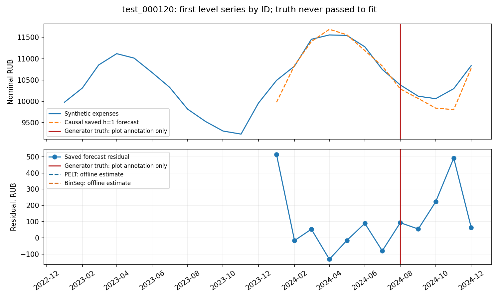
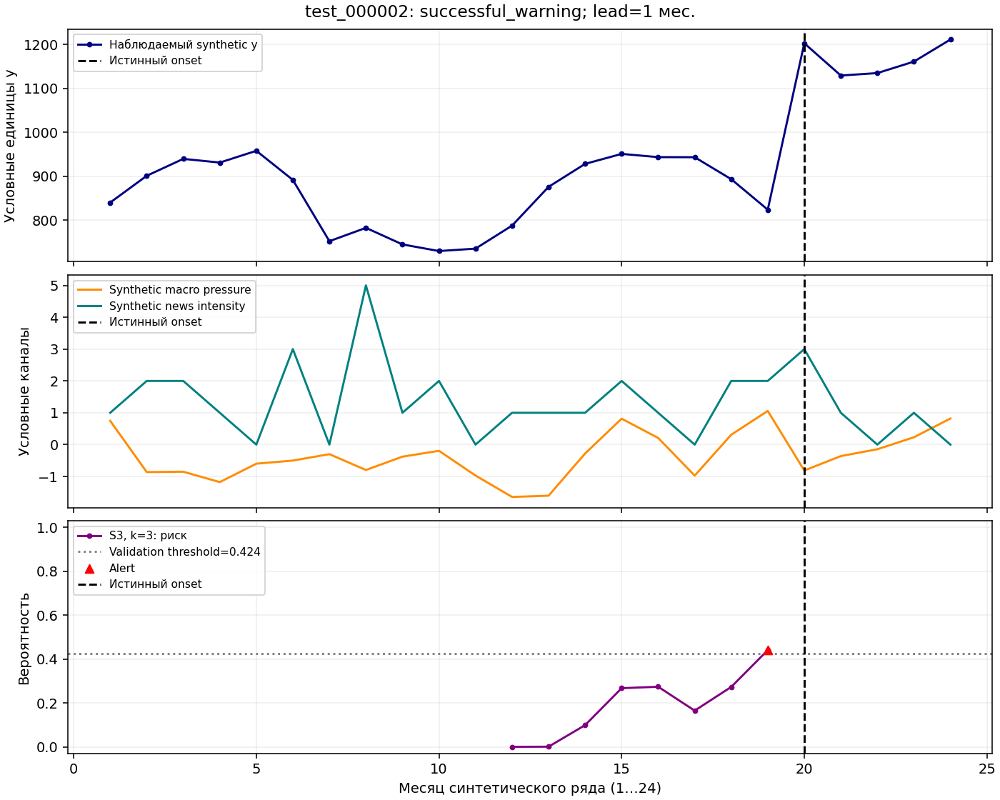
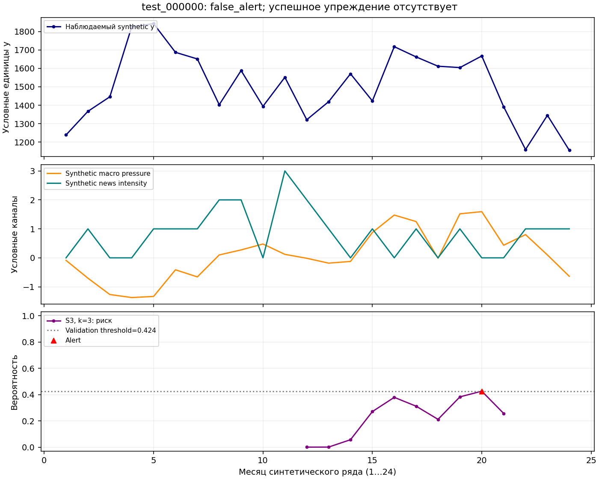
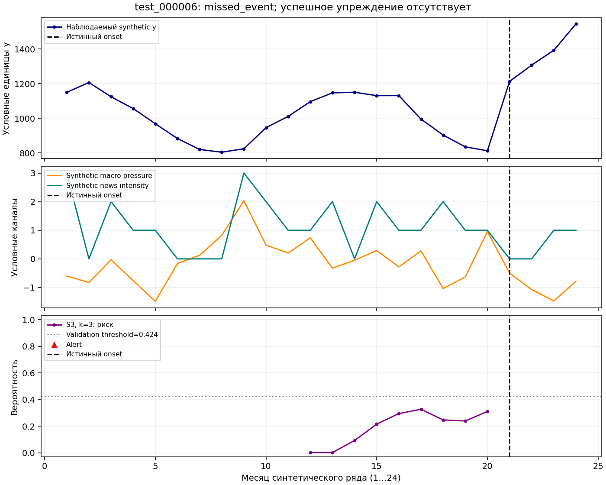

# Прогнозирование расходов и обнаружение структурных изменений на муниципальной панели

Методологический отчёт. Зафиксированные результаты исследования на данных за январь 2023 — декабрь 2024.

Отчёт рассматривает прогнозирование месячных расходов, обнаружение начавшегося изменения и предупреждение будущего сдвига. Численные результаты взяты из [финальной сводки](RESULTS_SUMMARY.md), [машиночитаемого описания](results_summary.json) и сохранённых таблиц метрик. Методика уточнена по конфигурациям и исходным отчётам, без новых экспериментов. Реальные результаты, синтетическая оценка и диагностика без независимой разметки разделены.

## 1. Постановка задачи

Объект исследования — месячное значение категории «Все категории» для муниципального образования, далее МО. Показатель описывает средние безналичные расходы жителей МО в номинальных рублях. Его нельзя интерпретировать как совокупный оборот территории: среднее значение и сумма расходов имеют разные знаменатели, а представленная выборка безналичных операций не охватывает всю экономическую деятельность.

Первая задача — **forecasting**: по доступной истории получить численный прогноз через 1, 3, 6 или 12 календарных месяцев. **Horizon** обозначает расстояние от даты выпуска прогноза до целевого месяца. Качество измеряется ошибкой в исходной рублёвой шкале. Прогноз может быть полезен, даже если он не объясняет причину изменения и не выдаёт отдельного предупреждения.

Вторая задача — **change-point detection**, обнаружение устойчивого изменения в поведении ряда. В проекте анализируется ошибка прогноза: фактические расходы минус значение, ожидаемое сезонным baseline. **Change point** — предполагаемая граница нового режима этой ошибки. Online detector получает наблюдения последовательно и может сообщить об изменении после его начала. Offline detector сегментирует уже доступный отрезок целиком, включая наблюдения после предполагаемой границы.

Третья задача — **early warning**: до начала нового режима оценить вероятность его появления в ближайшие месяцы. Здесь недостаточно поставить точку рядом с уже произошедшим сдвигом. Предупреждение должно предшествовать onset, дате начала события, и использовать только информацию, доступную на дату решения. Важны доля заранее предупреждённых событий, ложные тревоги и **lead time**, число месяцев между предупреждением и onset.

$$
p_{i,O,k}=\Pr\!\left(\text{новый onset в }(O,O+k]\mid\mathcal I_{i,O}\right).
$$

Здесь $\mathcal I_{i,O}$ — история, состояние online-детектора и внешние features, доступные на дату решения; $k$ — окно предупреждения. Будущие наблюдения нужны только для установления метки и оценки.

Задачи требуют разных меток и метрик. Хорошая MAE не доказывает способность предупреждать события, а точная ретроспективная локализация не означает положительный lead time. Forecasting проверяется на реальных фактах, detection — на синтетических событиях с известной истиной, а real early warning начинается с проверки достаточности данных.

## 2. Данные и единица наблюдения

Реальная целевая панель содержит 24 календарных месяца: январь 2023 — декабрь 2024. В ней представлены 2190 МО. Согласно сохранённому первичному описанию данных (`reports/audit_report.md`, приватный файл вне Git), исходный набор включает шесть категорий: «Продовольствие», «Здоровье», «Маркетплейсы», «Общественное питание», «Транспорт» и «Все категории». В прогнозных экспериментах используется только последняя. Исходные архивы при подготовке этого отчёта повторно не проверялись; сведения о категориях и территориальной привязке относятся к сохранённому первичному описанию.

**Таблица 1. REAL DATA — состав целевой панели.**

| Параметр | Значение |
| --- | --- |
| Период | январь 2023 — декабрь 2024 |
| Календарных месяцев | 24 |
| МО в целевой панели | 2190 |
| Категорий в первичном описании | 6 |
| Целевая категория | «Все категории» |
| Шкала цели | средние безналичные расходы, номинальные рубли |
| Наблюдаемых значений цели | 50521 |
| Полных рядов | 2016 |
| Пропущенных ячеек календарной панели | 2039 |
| Подтверждённые исторические даты публикации цели | отсутствуют |

Покрытие описано в сохранённом локальном data audit (`outputs/prophet_comparison_v1/data_audit.json`, вне Git), указанном в provenance финальной сводки. В неполных рядах календарная сетка сохраняется: пропуск не сдвигает следующие месяцы и не превращается в нулевые расходы. Это важно для прошлогодней опоры, лагов и доступности обучающей метки.

При подготовке входного CSV применён исторический справочник МО. Территориальная запись сопоставлялась году наблюдения при условии `year_from ≤ year < year_to`; открытый верхний интервал обозначался служебным значением справочника. Такой **time-aware join** учитывает время действия территориального описания. Загрузчик прогнозного pipeline не выполняет это сопоставление заново для каждого origin: он работает с уже подготовленной панелью. Годовая привязка сама по себе не подтверждает точные даты публикации административных изменений.

Территориальные различия полезны для обучения общей модели, но не удлиняют историю. Все МО наблюдаются в одни календарные месяцы и испытывают общие национальные изменения. Поэтому 2190 рядов не означают 2190 независимых реализаций каждой даты. Для проверки на новых экономических периодах остаются 24 месяца, а после формирования лагов и меток — ещё меньше.

Прогнозное сравнение выполнено на общей пилотной выборке: из 64 запрошенных МО оценены 63. У одного МО отсутствовали необходимые факты; исключение отражено в coverage, полноте оцениваемых случаев. Общие модели могли обучаться на доступной истории всей панели. Расширение real early-warning feasibility на все МО проверяет достаточность разметки, без расширения измеренного прогнозного качества.

## 3. Temporal protocol и защита от утечки

**Forecast origin**, далее `O`, — конец месяца, в который выпускается прогноз. **Rolling-origin backtest** повторяет этот выпуск на последовательности дат: модель получает исторический префикс, обучается в пределах доступной информации и прогнозирует заданный horizon. Для каждого следующего origin префикс расширяется, но будущий факт предыдущего прогноза не становится доступным раньше своей предполагаемой даты публикации.

При `release_lag_months=0`, далее `L=0`, факт месяца считается доступным к его концу. Это допущение: исторические даты публикации и **vintages**, версии показателя, существовавшие на соответствующие даты, не подтверждены. Backtest соблюдает календарную границу на имеющейся версии данных, без воспроизведения неизвестной истории пересмотров.

Validation включает целевые месяцы до июня 2024; holdout — июль–декабрь 2024. **Validation** используется для предусмотренных настроек и диагностических сравнений. **Holdout** — выделенный последующий период оценки. Разбиение определяется временем целевого факта и доступностью истории, а не случайным распределением строк. Для h=1, 3 и 6 в holdout имеются шесть origins и по 378 оцениваемых случаев; для h=12 — одна origin и 63 случая. На validation число origins уменьшается с horizon: шесть, четыре и одна соответственно; годовая validation отсутствует.

Случайный row split дал бы слишком оптимистичную оценку: соседние месяцы одного МО имеют общую историю, а разные МО одного месяца — общие внешние условия. Попадание будущих строк в train раскрывает часть проверяемого периода. Поэтому обучающие пары и features, входные признаки, ограничены информацией на origin; последующий факт используется только для оценки.

Историческая direct-пара с origin `r` и horizon `h` допускается в обучение на `O` только при доступном целевом месяце: `r+h+L ≤ O`. Её признаки строятся из истории, доступной на `r`, а не из более длинного префикса на `O`.

Пропуски сохраняются как неизвестные значения. Rolling statistics считают только конечные наблюдения и дополнительно передают их количество; модель может отличать слабую историю от полноценной. Календарь будущего целевого месяца известен заранее и допустим как feature. Фактические будущие расходы, будущая национальная медиана и ретроспективно найденные breakpoints в features не входят.

Все стратегии оцениваются на общих ключах `(МО, origin, horizon, target month)`: 1890 случаев с одинаковыми фактами. **Fallback**, резервный прогноз, сохраняется в оценке и обозначается отдельно. Отбор только успешных модельных строк скрыл бы проблемы coverage и изменил набор случаев.

Holdout просмотрен после первоначального пилота Prophet. Последующие ablations, проверки отдельных компонентов, использовали тот же период и не являются новой слепой проверкой. Итоговая таблица описывает фиксированные стратегии; выбор варианта по просмотренному holdout не гарантирует такого же прироста на новом периоде. Протокол и размеры выборок сохранены в [финальном JSON](results_summary.json) и [исходном прогнозном отчёте](../results/E01_prophet_comparison.md).

## 4. Методы прогнозирования

### 4.1. Простые baselines

**Baseline** — простой ориентир для сравнения моделей. LastValue переносит последнее доступное значение вперёд. SeasonalNaive использует тот же месяц предыдущего года, а при отсутствии сезонной опоры — последнее доступное значение. Усложнение модели должно быть обосновано преимуществом перед этими ориентирами.

SeasonalNaiveYoY сохраняет прошлогоднюю сезонную базу и корректирует её по наблюдаемому годовому росту. Из трёх последних календарных позиций доступной истории берутся отношения значения к тому же месяцу предыдущего года. Медиана конечных отношений ограничивается диапазоном от 0.5 до 2 и фиксируется на forecast origin. Сезонная опора умножается на этот коэффициент; отрицательное итоговое значение ограничивается нулём.

Прогноз использует только историю, доступную к forecast origin. Если годовые пары ещё отсутствуют, коэффициент принимается равным единице. Если конкретная сезонная опора отсутствует, используется последнее доступное, а при продолжении прогноза — предыдущее предсказанное значение. Коэффициент роста не переоценивается по собственным будущим прогнозам и не возводится в степень, зависящую от horizon.

Это компактная модель меняющегося уровня при сохранении календарной формы. Медиана уменьшает влияние одиночного выброса, но не устраняет риск того, что недавний рост окажется временным. LastValue и рекурсивный CatBoost сохранены в исходном пилоте; основная финальная таблица содержит девять отдельно зафиксированных стратегий, без автоматического переключения между ними задним числом.

### 4.2. Prophet

Prophet рассматривается в двух вариантах на общей pilot-выборке. ProphetAuto оставляет автоматическое включение годовой сезонности; ProphetYearly принудительно задаёт годовую компоненту с Fourier order 3. В обоих вариантах daily и weekly seasonality выключены, changepoint prior scale равен 0.05, seasonality prior scale — 1, uncertainty samples — 0. Минимальная история для прогнозного случая составляет 12 наблюдений; seed зафиксирован.

Автоматическая годовая сезонность в использованной версии Prophet требует более длинной истории, чем доступные префиксы пилота. Поэтому ProphetAuto фактически работал без годовой компоненты. Это следует из сохранённых настроек и правила версии, без дополнительного обучения. ProphetYearly проверяет принудительную сезонность, но короткая история затрудняет её отделение от тренда.

Оба Prophet оцениваются на тех же ключах и в исходной рублёвой шкале, без исключения неудобных случаев. Общий набор прогнозных случаев позволяет сравнивать ошибки методов при одинаковой доступности фактов. Их преимущество должно подтверждаться сопоставимой оценкой. Конфигурация выполненного пилота сохранена в локальном `outputs/prophet_comparison_v1/config_resolved.yaml` (вне Git); публичная конфигурация — [prophet_comparison.yaml](../../configs/prophet_comparison.yaml).

### 4.3. Global boosting

CatBoostRecursive, CatBoostDirect и LightGBMDirect — общие модели по историческим примерам разных МО. Вход включает лаги, скользящие mean/std/count, недавнее изменение, календарные features и time index. Полный список — в приложении A. Модель использует историю ряда; идентификатор МО не входит в признаки.

Модель прогнозирует изменение относительно anchor — последнего доступного значения на историческом origin. Разность прибавляют к anchor и получают прогноз в рублях. Преимущество обучения изменения перед обучением уровня отдельно не проверялось.

Recursive-модель учится прогнозировать следующий месяц. Для большего horizon её собственное предсказание добавляется в историю и используется на следующем шаге. Это экономит число отдельных моделей, но ошибки и смещение могут накапливаться. Direct-модель обучается отдельно для каждого horizon на уже известных будущих значениях исторических пар. Ей не нужны промежуточные предсказанные факты, зато на длинном horizon доступно меньше обучающих пар.

Календарные features direct-варианта относятся к месяцу `r+h`, а lag и rolling features — к доступному префиксу. CatBoost использует MAE loss, LightGBM — regression L1; настройки приведены в приложении B. При отсутствии допустимых пар применяется сезонный fallback. Ошибки обучения или прогнозирования имеют отдельный статус и не скрываются за резервом.

### 4.4. National/Local decomposition

National/Local разделяет общий уровень расходов и относительное положение МО:

$$
y_{i,t}=N_t\,R_{i,t},\qquad
R_{i,t}=\frac{y_{i,t}}{N_t}.
$$

`N_t` — национальная медиана конечных расходов доступной панели в месяце `t`; `R_{i,t}` — отношение расходов МО к этой медиане. Компонента строится по всей доступной панели, а не только по прогнозному пилоту. Состав наблюдаемых МО может меняться из-за пропусков, поэтому это медиана доступных значений, а не показатель заранее установленной сбалансированной панели.

На origin национальная история обрывается на доступном месяце. Будущий фактический `N_t` не используется для прогнозных features. Вместо него SeasonalNaiveYoY отдельно строит `\hat N_{O+h}`. Локальная direct-модель CatBoost или LightGBM получает те же группы features, рассчитанные по истории ratio, и прогнозирует его изменение относительно локального anchor. Затем расходы восстанавливаются:

$$
\hat y_{i,O+h}=\max\!\left(0,\hat N_{O+h}\,\hat R_{i,O+h}\right).
$$

В исторических обучающих метках фактическая национальная компонента допустима только для целевого месяца, уже доступного на дату обучения. Будущий факт не участвует в прогнозе. Последующее сравнение `\hat N` с фактом служит диагностикой и не меняет прогнозные входы.

Разложение выделяет положение территории относительно общих условий, но вводит два источника ошибки: национальный прогноз и локальное ratio. Сравнение с моделью в исходной шкале одновременно меняет историю, обучающую цель и национальный прогноз; оно не изолирует эффект одного feature.

National/Local + LightGBM остаётся исследовательской стратегией. Наблюдавшийся минимум holdout MAE в основной таблице требует сопоставления с validation и повторения на новых периодах. Метод и настройки описаны в [отчёте о разложении](../results/E05d_national_local_lightgbm.md) и [конфигурации](../../configs/national_local_lightgbm.yaml).

### 4.4.1. National/Local Persistence

Методологическая ablation проверяет, какая часть наблюдаемого улучшения National/Local + LightGBM сохраняется без обучения локальной динамики. Используется прежнее разложение расходов муниципальных образований СберИндекса:

$$
y_{i,t}=N_t R_{i,t},\qquad
\hat R_{i,O+h}=R^{last}_{i,O},\qquad
\hat y_{i,O+h}=\hat N_{O+h}R^{last}_{i,O}.
$$

`R_last` — последнее конечное отношение расходов МО к национальной медиане того же месяца, доступное не позже `O−L`. Национальная медиана и её прогноз SeasonalNaiveYoY переиспользованы без изменений. Локальное отношение фиксируется для всех горизонтов. Правило последнего отношения задано заранее; tuning и поиск признаков не проводились.

Сравнение LightGBMDirect → National/Local Persistence → National/Local + LightGBM выполнено на прежних 1890 случаях с конечным фактом у 63 МО, с теми же ключами, пропусками, датами доступности и разделением validation/holdout. Reproduction gate пройден пересчётом метрик сохранённых reference predictions; новых model fits — 0. Holdout уже просмотрен, поэтому ablation является описательной проверкой компонентов, а не новым слепым тестом.

На holdout h=1/3/6 Persistence закрывает 68.32% / 69.24% / 76.26% наблюдаемого разрыва MAE между LightGBMDirect и National/Local + LightGBM. Обучение локальной модели дополнительно уменьшает holdout MAE относительно Persistence на 7.47% / 5.67% / 6.61%. Это указывает на существенную роль разложения в данном сравнении; доля разрыва не измеряет причинный вклад.

Устойчивость ограничена: Persistence уступает SeasonalNaiveYoY на всех validation горизонтах и на holdout h=3/6, а learned вариант на validation h=3/6 уступает Persistence. На holdout улучшение Persistence относительно LightGBMDirect приходится лишь на 3 из 6 дат для h=1 и h=6. Предзаданные критерии дают категорию D на каждом основном горизонте. h=12 остаётся описательным: Persistence применяет фиксированную формулу, тогда как обе learned references используют прежний SeasonalNaive fallback; годовое обучение этим не оценено.

Сохранённые [результаты ablation](../results/national_local_persistence.md), [метрики](../results/national_local_persistence/metrics.csv), [сравнения по датам](../results/national_local_persistence/origin_stability.csv) и [конфигурация](../../configs/national_local_persistence.yaml) описывают отдельную проверку разложения; состав девяти основных стратегий не расширяется.

### 4.5. Foundation model: Chronos-2

Chronos-2 проверен в режиме **zero-shot**: готовый checkpoint применён без обучения на проектной панели. Инференс выполнен на CPU в float32; точечный прогноз соответствует quantile 0.5. Вход сохраняет календарные пропуски, внешние covariates не добавляются, cross-learning выключен. Поэтому сравнение относится к конкретному использованному режиму, а не ко всем возможным способам адаптации foundation model.

На holdout Chronos-2 не превзошёл SeasonalNaiveYoY на короткой истории. Предобучение само по себе не гарантирует преимущества для конкретного ряда. Результат относится к проверенному zero-shot режиму; fine-tuning и другие конфигурации не оценивались. Он не доказывает бесполезности foundation models для других данных и способов применения.

Checkpoint выпущен 20 октября 2025, после периода backtest; возможное пересечение pretraining с оцениваемой историей не исключено. Это ретроспективное применение модели, без подтверждения её доступности в 2024 году. Revision, зависимости и режим сохранены в [отчёте Chronos-2](../results/E03_chronos_zero_shot.md) и [конфигурации zero-shot](../../configs/chronos_zero_shot.yaml).

## 5. Результаты прогнозирования

**REAL DATA.** Основная метрика — MAE в номинальных рублях. Для каждой территории сначала усредняется абсолютная ошибка по доступным прогнозным случаям, затем берётся среднее по МО. Это **MAE macro**, дающая территории одинаковый вес. Дополнительные micro-метрики сохранены в CSV, но не подменяют основной показатель.

$$
\operatorname{MAE}_{macro}
=\frac{1}{M}\sum_{i=1}^{M}
\frac{1}{n_i}\sum_{j=1}^{n_i}
\left|y_{i,j}-\hat y_{i,j}\right|.
$$

**Таблица 2. REAL DATA — holdout MAE macro, рубли, оценка стратегии вместе с fallback.**

| Модель | h=1 | h=3 | h=6 | h=12 |
| --- | --- | --- | --- | --- |
| SeasonalNaive | 4175.15 | 4175.15 | 4175.15 | 4322.14 |
| SeasonalNaiveYoY | 920.70 | 1240.40 | 1906.01 | 4322.14 |
| ProphetAuto | 1868.56 | 2041.31 | 2165.78 | 3054.18 |
| ProphetYearly | 1682.31 | 1679.62 | 1937.65 | 8496.01 |
| CatBoostDirect | 986.22 | 1939.17 | 3349.50 | 4322.14† |
| LightGBMDirect | 1003.28 | 1449.82 | 2463.21 | 4322.14† |
| National/Local + CatBoost | 823.42 | 1225.69 | 2132.67 | 4322.14† |
| National/Local + LightGBM | **799.55** | **1212.73** | **1897.22** | 4322.14† |
| Chronos-2 | 1947.35 | 2526.33 | 4150.59 | 9163.47 |

Источник: [forecasting_metrics.csv](forecasting_metrics.csv), holdout, MAE macro. Числа округлены из полной точности до двух знаков. Жирным отмечен минимум среди девяти строк этой таблицы для h=1/3/6.

† На h=12 четыре direct-стратегии полностью используют SeasonalNaive fallback: на единственной origin, декабре 2023, доступных direct-пар нет. Значение 4322.14 не характеризует обученную годовую boosting-модель. У SeasonalNaiveYoY годовой результат также совпадает с сезонным baseline из-за доступной истории. У всех методов h=12 имеет только одну origin; устойчивый годовой ranking из этих данных не следует.

SeasonalNaiveYoY имеет меньшую holdout MAE, чем оба Prophet, на h=1/3/6. National/Local + LightGBM даёт минимум среди девяти основных стратегий на этих горизонтах. На h=6 его результат близок к SeasonalNaiveYoY, поэтому сам факт минимального округлённого значения не доказывает устойчивое практическое превосходство. Промежуточные trend-ablation не входят в основную таблицу и на отдельных горизонтах имели меньшую ошибку; глобальный минимум среди всех исследованных вариантов не заявляется.

**Таблица 3. REAL DATA — выбранные validation MAE macro, рубли.**

| Модель | h=1 | h=3 | h=6 |
| --- | --- | --- | --- |
| SeasonalNaiveYoY | 1354.90 | 2468.22 | 4777.16 |
| ProphetAuto | 1730.34 | 1436.84 | 1981.26 |
| National/Local + CatBoost | 1391.41 | 2789.24 | 5162.10 |
| National/Local + LightGBM | 1370.55 | 2819.74 | 5525.34 |

Источник: тот же [forecasting CSV](forecasting_metrics.csv), validation. Здесь National/Local + LightGBM уступает SeasonalNaiveYoY на всех трёх горизонтах. Для h=6 имеется только одна validation origin. Различие между validation и holdout показывает зависимость результата от периода; финальный выбор устойчивого победителя не сделан.

### 5.1. Устойчивость сравнения прогнозов

Сравнение на одинаковых наблюдениях проверяет, насколько разница MAE сохраняется по территориям и датам выпуска. В [анализе сохранённых прогнозов](../results/forecast_robustness.md) сверены ключи МО × origin × target month × horizon, факты, split, статусы и доступность истории; дубли не допускаются, fallback остаётся частью стратегии. Для каждого случая рассчитывается разность абсолютных ошибок baseline и candidate. Она усредняется сначала внутри МО, затем между МО с равными весами: положительная ΔMAE означает меньшую ошибку candidate. Validation и holdout не объединяются; h=1/3/6 рассматриваются отдельно.

Доля муниципалитетов с меньшей ошибкой — доля МО, где MAE candidate меньше MAE baseline. Отдельно сравниваются ошибки по forecast origins и число дат с положительной разностью. Основной origin-cluster bootstrap повторно выбирает даты выпуска целыми блоками со всеми их МО; в каждой выборке пересчитывается парная MAE macro. Дополнительный municipality-cluster bootstrap выбирает МО со всей их историей и служит пространственной проверкой чувствительности. Общие национальные шоки связывают территории, поэтому эта проверка не заменяет оценку по времени. Анализ концентрации сопоставляет положительные и отрицательные вклады территорий и доли улучшения, приходящиеся на крупнейшие вклады; он не доказывает отсутствие влияния выбросов.

На основных горизонтах имеется лишь 4–6 origins, а на validation h=6 — одна. Даты выпуска не считаются независимыми: история соседних прогнозов пересекается, целевые месяцы разных горизонтов могут совпадать. 95% origin-интервалы — описательная оценка чувствительности к наблюдаемым датам, а не независимое подтверждение будущего качества. При одной origin интервал не оценивается. Доля положительных bootstrap draws не является frequentist p-value. Diebold–Mariano не оценивался из-за слишком короткого временного ряда разностей потерь; h=12 с одной датой выпуска исключён из вывода об устойчивости. Holdout уже просмотрен: анализ не является новым слепым тестом, не меняет прогнозы и не подбирает модель по итоговой оценке.


*Рисунок 1. REAL DATA. MAE основных стратегий по horizon; годовой fallback обозначен на графике. Расстояния между столбцами описывают сохранённый holdout, без оценки стабильности на новых периодах.*


*Рисунок 2. REAL DATA. Сохранённые одномесячные прогнозы SeasonalNaiveYoY и последующие факты для МО 21, первого по числовому идентификатору в оцениваемой выборке. Пример показывает календарное выравнивание и отдельные ошибки; он не заменяет panel MAE.*

Графики используют сохранённые прогнозы; ряд выбран по воспроизводимому правилу, без отбора по точности. Оценка относится к общей pilot-выборке, а не ко всем 2190 МО или автоматической политике выбора модели.

## 6. Ablations и внешние факторы

**Ablation** проверяет роль компонента на сопоставимых случаях. Дополнительно изучены сезонный тренд, представление месяца и национальные макропрогнозы. Эти сравнения выполнены после просмотра holdout и служат исследовательской диагностикой.

Linear и damped trend оценивают скорость изменения по доступным годовым разностям и продолжают её поверх сезонной формы. У damped-варианта дальнейшие шаги получают уменьшающийся вес. Часть holdout улучшилась относительно SeasonalNaiveYoY, однако validation на коротких горизонтах ухудшилась. На длинных горизонтах нехватка годовых пар ограничивала собственный прогноз и увеличивала роль fallback. Поэтому наблюдавшееся улучшение не стало основанием заменить фиксированный baseline.

Сравнивались numeric+sin/cos features месяца и категориальный месяц с one-hot внутри CatBoost. Эффект зависел от horizon; универсального преимущества one-hot нет. В последующих опытах сохранено исходное представление, без выбора по просмотренному holdout.

Макро features использовали исторически датированные национальные прогнозы инфляции и реального потребления. Инфляция — медиана опроса профессиональных участников, опубликованного Банком России, а потребление — собственный прогноз Банка России; середина опубликованного диапазона потребления является явно обозначенным производным значением. Для каждой исторической пары выбиралась информация, доступная на её собственный origin, и прогноз соответствующего целевого года.

Макропризнаки меняли MAE неодинаково; устойчивое улучшение по периодам и горизонтам не установлено. Годовой прогноз не преобразовывался в региональное месячное наблюдение делением на число месяцев; номинальная цель не дефлировалась. Современные исторические таблицы без подтверждённых vintages остались scenario-only, а региональные месячные ИПЦ и зарплаты не использовались. Подробности — в приложении C.


### 6.1. Leading financial indicators

**Мотивация.** Для прогнозирования муниципальных расходов SberIndex проверены ключевая ставка Банка России и официальный USD/RUB Банка России. Ставка потенциально связана с кредитованием и сбережениями, FX — с импортными ценами и ожиданиями. Опережающий механизм требует проверки.

**Историческая доступность.** Аудит финансовых источников допустил эти источники при доверии официальному архиву без независимых historical snapshots. Остальные ряды отнесены к B/C из-за недостаточной реконструкции first-release timing и vintages; фиксированный лаг этого не исправляет. При построении финансовых признаков получены десять признаков на 12 origins с cutoff 00:00 Europe/Moscow последнего дня месяца. Ставка требует доступного объявления и наступившей effective date; date-only объявление доступно со следующего дня. Для FX effective midnight — консервативная граница доступности при публикации до вступления курса в силу, не actual publication time. Обучающая пара использует свою origin `r`, а не позднейшее знание на `O`. Future observations/backfill исключены; cutoff checks пройдены. Неизвестные vintages расходов и смена методики FX в июне 2024 остаются ограничениями.

**Forecasting ablation.** Сравнены базовая модель без финансовых признаков, вариант с пятью признаками ставки, вариант с пятью FX и вариант со всеми десятью. Основная модель — National/Local + LightGBM; LightGBMDirect — sensitivity. Протокол и параметры National/Local + LightGBM фиксированы; базовый вариант воспроизведён, tuning отсутствовал. Вариант со всеми финансовыми признаками должен был улучшить MAE macro в обеих частях минимум на двух горизонтах из h=1/3/6 с проверкой концентрации по origins. Улучшился только h=6: вариант только с FX −1.67% / −2.11%, вариант со всеми финансовыми признаками −1.67% / −1.78% на validation / holdout. Validation h=6 имеет одну origin, holdout просмотрен. Ставка устойчивого улучшения не дала; финансовые sensitivity-варианты ухудшили holdout. Вывод — **no stable forecasting uplift**; h=6 не доказывает predictive effect.

**Early-warning diagnostic.** Диагностика финансовых предвестников использовала weak-event labels и onset dates, построенные по устойчивым изменениям ошибки прогноза: 73 муниципальных события, шесть onset months мая–октября 2024, 12 origins. Это сдвиги ошибки SeasonalNaiveYoY, а не независимо размеченные экономические шоки. Единица анализа — календарная дата. Positive требует хотя бы одной fully-known positive метки в исходной eligible at-risk группе; negative — непустой группы с полностью известными отрицательными метками. Остальные даты unknown; сохранены censoring и подтверждение до `O+k+2`. Для k=1 получено 6 eligible / 6 positive / 0 negative, для k=3 — 4 / 4 / 0. Без отрицательных дат сравнительный эффект и permutation inference non-estimable; raw/Holm p-values — NA. Общего направления ставки/FX перед шестью onset months не обнаружено. Classifier fits и tuning порогов отсутствовали. Синтетические данные в этой диагностике не использовались.

**Интерпретация.** Дополнительный precursor effect оценить не удалось; отсутствие предвестников этим не доказано. Национальные признаки, повторённые для МО, не добавляют независимых календарных наблюдений. Для сравнения нужны более длинная история цели и сопоставимые известные отрицательные даты.

Протоколы: [Построение финансовых признаков](../../configs/leading_financial_e08b.yaml), [Forecasting ablation](../../configs/e08c_leading_financial_forecasting.yaml), [Диагностика early warning](../../configs/e08d_real_financial_early_warning.yaml). Подробные отчёты — в [сводке финансовых индикаторов](RESULTS_SUMMARY.md#leading-financial-indicators); полные outputs и raw cache остаются локальными. Основные итоговые таблицы и результаты предыдущих этапов сохранены.

## 7. Online change-point detection

### 7.1. Вход и calibration

Детекторы получают forecast residuals `e_t=y_t-\hat y_t` от SeasonalNaiveYoY. Вычитание ожидаемой сезонной формы позволяет искать систематический сдвиг ошибки. Он может отражать как изменение расходов, так и недостаток baseline; экономическая интерпретация требует проверки.

**Calibration** здесь означает приведение ошибок к рабочему масштабу и выбор порога сигнала. Первые четыре конечные ошибки дают фиксированный центр — медиану — и масштаб: максимум из MAD, умноженного на 1.4826, доли 0.03 медианного абсолютного прогноза и одного рубля. MAD — медиана абсолютных отклонений ошибок от их медианы. Дальше детектор получает стандартизованную ошибку. Нормировка не использует будущий мониторинговый отрезок и не объединяет масштабы разных МО.

CUSUM накапливает положительные и отрицательные отклонения. EWMA поддерживает экспоненциально взвешенное среднее с большим весом недавних ошибок. BOCPD, Bayesian Online Change Point Detection, обновляет распределение длины режима; сигнал основан на вероятности короткого положительного run length, а не нулевой длины.

Параметры и пороги выбраны по synthetic validation с бюджетом ложных тревог на controls без изменений и с одиночными выбросами. После выданного сигнала online-состояние сбрасывается; следующие два календарных месяца подавляют новый сигнал, продолжая обновление. В реальной диагностике январь–апрель 2024 служат warmup, а май–декабрь — мониторингом. Пропуск сохраняет календарь и пропускает обновление. Методика и рабочие точки приведены в [online-отчёте](../results/E04a_online_detection.md).

### 7.2. Количественная оценка

**SYNTHETIC BENCHMARK.** Независимых меток реальных structural shocks нет, поэтому качество detection измерено на сгенерированных рядах с известными onset. Основная таблица относится к TEST-срезу устойчивых level-событий: 360 событий и 2880 monitoring-месяцев. Контрольные сценарии нужны для calibration; показатели таблицы не являются усреднением по всему синтетическому корпусу.

Сигнал сопоставляется одному событию в окне от onset до трёх месяцев после него включительно. Сигнал до onset и лишние повторные сигналы считаются false positives. Precision — доля сопоставленных сигналов; recall — доля обнаруженных событий; F1 объединяет их. FP/12 нормирует false positives на 12 monitoring-месяцев. Медиана detection delay считается только по обнаруженным событиям и не учитывает пропуски как бесконечную задержку.

**Таблица 4. SYNTHETIC BENCHMARK — online detection на TEST.**

| Метод | Precision | Recall | F1 | FP/12 | Медиана delay, мес. |
| --- | --- | --- | --- | --- | --- |
| CUSUM | 0.650 | 0.386 | 0.484 | 0.312 | 1 |
| EWMA | 0.641 | 0.347 | 0.450 | 0.292 | 0 |
| BOCPD | 0.702 | 0.333 | 0.452 | 0.212 | 1 |

Источник: [detection_metrics.csv](detection_metrics.csv), data_status=`synthetic`, split=`test`, scope=`primary_level`, family=`online`. Метрики округлены до трёх знаков; delay выражен в календарных месяцах.

CUSUM имеет наибольшие recall и F1 среди этих рабочих точек. BOCPD даёт большую precision и меньшую частоту ложных сигналов, но обнаруживает меньшую долю событий. EWMA имеет нулевую медиану delay среди найденных событий; это не означает, что он обнаруживает все события немедленно. Выбор метода зависит от допустимой нагрузки ложных тревог и стоимости пропуска.


*Рисунок 3. SYNTHETIC BENCHMARK. Сохранённое сравнение online-методов показывает precision/recall tradeoff при выбранных на validation порогах. Это оценка искусственных событий, без переноса качества на реальные МО.*

### 7.3. Реальная диагностика

**REAL DATA — DIAGNOSTIC.** На 63 МО и 504 monitoring-месяцах для каждого метода получено 104 сигнала CUSUM, 97 EWMA и 14 BOCPD. Это количество сигналов, а не true positives. Без независимой разметки нельзя вычислить реальную precision, recall или доказать экономическую природу найденного сдвига.

Диагностика показывает частоту срабатываний и формирует очередь для анализа. Проверка причин требует анализа фактов, сезонного прогноза, территориальной истории и внешних сведений; независимая проверка не выполнена.

## 8. Offline change-point detection

Offline segmentation видит весь анализируемый отрезок. PELT и Binary Segmentation ищут разбиение стандартизованных residuals на сегменты с разным средним. PELT рассматривает штрафуемую сегментацию с отсечением кандидатов, Binary Segmentation последовательно делит отрезок. Использованы реализации из `ruptures` с L2 cost; основные настройки сохранены в приложении B.

После готовности масштаба алгоритм получает полный доступный residual-отрезок, включая warmup. При подсчёте exposure учитываются только monitoring-месяцы. Пропуски исключаются из численного cost без заполнения нулями; граница возвращается в исходный календарь как первый наблюдаемый месяц правого сегмента. Последняя техническая граница конца массива не является change point.

В синтетической оценке используется то же окно сопоставления после onset. **Localisation error** — календарное расстояние от найденной границы до даты события. Эта ретроспективная ошибка не равна online detection delay и не показывает, когда границу можно было узнать без будущих наблюдений.

**Таблица 5. SYNTHETIC BENCHMARK — offline detection на TEST.**

| Метод | Precision | Recall | F1 | FP/12 | Медиана localisation error, мес. |
| --- | --- | --- | --- | --- | --- |
| PELT | 0.449 | 0.308 | 0.366 | 0.567 | 0 |
| Binary Segmentation | 0.441 | 0.258 | 0.326 | 0.492 | 0 |

Источник: [detection CSV](detection_metrics.csv), data_status=`synthetic`, split=`test`, scope=`primary_level`, family=`offline`; 360 событий, 2880 monitoring-месяцев. Медиана localisation error относится только к сопоставленным событиям.

Результаты относятся к выбранным cost, penalty и короткому отрезку; даже с доступом к будущему recall невысок. Числа online/offline описывают разные информационные условия. Offline-оценка также повторно использует просмотренный synthetic TEST online-этапа.

Проверка реализации PELT выявила расхождения по значению целевой функции с эталонным динамическим решением. Исходные сегментации сохранены; достижение глобального минимума не гарантируется. Подробности — в [offline-отчёте](../results/E06a_offline_detection.md).



*Рисунок 4. SYNTHETIC BENCHMARK. Первый level-ряд TEST по сохранённому правилу выбора. Оба метода пропустили событие; onset нанесён как разметка генератора. Пример иллюстрирует пропуск, без отдельной оценки качества.*

**REAL DATA — DIAGNOSTIC.** На реальных residuals PELT дал 81 candidate breakpoint, Binary Segmentation — 79. Эти полные числа включают границы warmup; в monitoring находятся соответственно 59 и 57. Они не являются подтверждёнными экономическими событиями. Сопоставление удлиняющихся префиксов с полной сегментацией показало пересмотры дат и исчезновение отдельных кандидатов.

Prefix stability показывает, как меняется ретроспективная оценка при добавлении данных. Сравнение с полной будущей сегментацией использует hindsight и не доказывает раннего предупреждения. Offline-границы не входят в early-warning features, чтобы исключить будущую информацию.

## 9. News / events pipeline и доступность внешней информации

### 9.1. От документа к feature

News pipeline превращает документы в датированные события и затем в features на forecast origin. **Historical availability** означает, что разрешена версия информации, которую можно обоснованно считать доступной к соответствующей дате. Современная копия страницы с исторической датой публикации сама по себе этого не доказывает: текст мог быть изменён позднее.

Для документа сохраняются URL, время получения, snapshot и hash. Версии сохраняются отдельно. Deduplication объединяет публикации об одном canonical event, включая PDF-копии релизов. Географическая привязка различает национальный, региональный и муниципальный уровни; темы задают предметные признаки. Неизвестная территория не назначается МО по умолчанию.

Агрегация использует `available_at`: событие входит в окно `(O-w,O]` только при доступности к origin. Event date и написанная на современной странице publication date не заменяют проверку версии. Первое допустимое представление canonical event задаёт доступные тогда geography/topics; поздние уточнения не переносятся назад. Missing flags отмечают NaN конкретного feature, например недоступное окно или неопределённую долю. Полнота архива проверяется отдельно: нулевой счётчик возможен и без missing flag и не доказывает отсутствие событий.

**Таблица 6. REAL DATA — финальный news-корпус и features.**

| Параметр | Значение |
| --- | ---: |
| URL-документы | 93 |
| Snapshots | 197 |
| Canonical groups | 89 |
| Численные features | 26 |
| Missing flags | 26 |
| Уникальные temporal vectors | 7 |
| Исторические regional/municipal events | 0 |

Источник: news-раздел [финального JSON](results_summary.json). Эти строки имеют разные знаменатели: документы, версии, группы событий и уникальные входные векторы нельзя складывать или считать одинаковыми наблюдениями.

Исторический слой ограничен смысловыми ядрами официальных решений и датированными архивными материалами с явным archive trust. Из 197 snapshots 21 допущен по записанной политике; к последней origin доступны 20 URL-документов. Знаменатели различаются: 20 URL не означают 20 независимых событий. Доверие архиву распространяется на смысловое ядро, а не весь современный HTML. Полнота архива не установлена; отсутствие regional/municipal events в разрешённом слое не доказывает отсутствия публикаций.

Национальное событие повторяется по МО, но остаётся одним событием одной даты. Тиражирование feature увеличивает число строк, не число независимых temporal vectors; случайный split может создать видимость большого объёма информации.

Pipeline реализован и проверен, но покрытия исторических публикаций недостаточно для надёжной оценки вклада news в forecasting или early warning. Прирост качества за счёт news не установлен. Методика версий и доступности описана в [news-отчёте](../results/E06b_news_events.md) и [дополнении о доступности](../results/E07a_early_warning_feasibility.md).

### 9.2. Макроинформация и vintages

Макроисточники разделены по статусу доступности. Датированные национальные прогнозы могли использоваться по собственным историческим публикациям. Современные workbooks с прошлой статистикой без подтверждённых vintages оставались scenario-only. Региональные месячные ряды ИПЦ и зарплаты не были получены в пригодном виде и не участвовали в модели.

Число строк источника не измеряет пользу для прогноза. Важны дата публикации, целевой год, версия и география. Даже тематически подходящий feature с неизвестной исторической доступностью может нарушить backtest.

## 10. Early warning на реальных данных

### 10.1. Weak labels и время появления метки

**Weak labels** — метки, созданные прозрачным правилом по наблюдаемым данным, без независимой экспертной истины. В этом проекте weak event обозначает устойчивое изменение ошибки SeasonalNaiveYoY. Это не разметка экономического шока и не обязательно структурное изменение самого уровня расходов.

Для предполагаемого onset `T` берутся четыре непосредственно предыдущих календарных residuals. Их медиана задаёт центр, а масштаб защищён снизу величиной прогноза и одним рублём:

$$
c_T=\operatorname{median}(e_{T-4:T-1}),\qquad
s_T=\max\!\left(
1.4826\,\operatorname{MAD}(e_{T-4:T-1}),
0.03\,\operatorname{median}|\hat y_{T-4:T-1}|,
1
\right),\qquad z_t=\frac{e_t-c_T}{s_T}.
$$

Кандидат onset `T` проходит пороговый критерий, если три последовательные ошибки `T,T+1,T+2` находятся по одну сторону порога: все `z≥3` либо все `z≤−3`. Все необходимые месяцы должны быть конечными. Подтверждение появляется лишь после третьего месяца. Кандидаты одного направления с разрывом не более двух месяцев объединяются; продолжение невосстановившегося режима не создаёт новый event. Recovery требует двух последовательных значений `direction_sign·z < 1.5` относительно замороженных центра и масштаба исходного события. Пропуск прерывает recovery и сохраняет uncertainty. Полное правило и обработка противоположного направления описаны в [отчёте weak-разметки](../results/E07a_early_warning_feasibility.md).

Целевая метка отвечает, произойдёт ли новый onset в `(O,O+k]`. Положительный и отрицательный классы становятся известны после полного будущего окна и подтверждения возможного события, не раньше `O+k+2` при рабочем лаге. Ранее найденное событие не допускается в train до завершения того же окна.

**Censoring** возникает, когда данных за концом окна ещё нет. Right-censored строка не является negative: отсутствие подтверждённого события пока означает неизвестную метку. Пропуски в необходимых прошлых или будущих месяцах также создают unknown. Для исключения уже активного режима используются только сведения, известные на origin; ретроспективное знание будущего режима остаётся диагностическим полем.

### 10.2. Проверка достаточности full panel

На 2190 МО найдено 73 weak events с шестью различными onset dates в 71 МО. Территориальное расширение дало больше событий, но мало независимых дат. Одно общее календарное изменение может породить много положительных строк и при этом почти не расширить условия временной проверки.

Граница доступной информации для train — июль 2024; test origins — август–ноябрь. Допускаются только полностью известные пригодные метки для случаев под риском. Для каждого k нужны не менее 30 train positives, 10 test positives, трёх train и двух test onset dates. Это минимальные условия оценки, без гарантии статистической мощности.

**Таблица 7. REAL DATA — пригодные train/test positives и onset dates.**

| k, мес. | Train positives | Test positives | Train onset dates | Test onset dates | Статус |
| --- | ---: | ---: | ---: | ---: | --- |
| 1 | 14 | 4 | 1 | 2 | недостаточно данных |
| 3 | 0 | 0 | 0 | 0 | пригодного temporal split нет |

Источник: full-panel real early-warning раздел [финального JSON](results_summary.json) и [early_warning_metrics.csv](early_warning_metrics.csv). Для k=3 нули описывают допущенные строки split, а не отсутствие weak events вообще.

Для k=1 первая train-метка появляется слишком поздно для накопления независимых событий; для k=3 ожидание окна и подтверждения ещё сильнее сокращает origins. Альтернативные календарные границы не устранили недостаток данных. Ослабление доступности или random row split допустило бы утечку.


*Рисунок 5. REAL DATA — FEASIBILITY. После корректного temporal split недостаточно положительных меток и onset dates. Это проверка достаточности выборки, без оценки качества классификатора.*

Классификатор на реальных данных **не обучался**. Precision, recall и lead time имеют статус `not_evaluated`; отсутствующие метрики остаются null. Это недостаток данных и временной разметки, а не ошибка pipeline или нулевое качество модели. [Full-panel отчёт](../results/E07b_early_warning_full_panel.md) содержит неизвестные метки, условия допуска случаев под риском и причины исключений.

## 11. Controlled synthetic early-warning benchmark

**SYNTHETIC BENCHMARK**

**Результаты этого раздела не являются оценкой способности предсказывать реальные экономические шоки.**

### 11.1. Генератор и независимые cohorts

Генератор создаёт независимые 24-месячные ряды TRAIN, VALIDATION и TEST с разными seeds. Он задаёт устойчивые сдвиги с известным onset, наблюдаемые предвестники (precursor), события без предвестников, ложные precursor без сдвига и разные уровни шума. Внешние каналы полностью синтетические, без реальных news или macro.

**Таблица 8. SYNTHETIC BENCHMARK — состав независимых cohorts.**

| Cohort | Рядов | Событий | С precursor | Без precursor | Controls | Controls с ложным precursor |
| --- | ---: | ---: | ---: | ---: | ---: | ---: |
| TRAIN | 600 | 360 | 270 | 90 | 240 | 84 |
| VALIDATION | 200 | 120 | 90 | 30 | 80 | 28 |
| TEST | 300 | 180 | 135 | 45 | 120 | 42 |

Источник: synthetic early-warning раздел [финального JSON](results_summary.json). Noise, сила и момент precursor варьируются: наличие сигнала не гарантирует предупреждение. Ложные precursor создают содержательную проверку того, что модель не должна считать любое внешнее отклонение будущим событием.

Истина — onset генератора. Метка известна после `O+k`, без трёхмесячного weak-подтверждения. Уже начавшийся режим исключается при формировании целевой выборки; истинный onset, идентификаторы и cohort не входят в features. Такой контроль допуска случаев — особенность синтетической среды.

### 11.2. Модели и выбор рабочих точек

Constant risk выдаёт частоту positive в TRAIN. History only использует историю ряда. History + detector state добавляет состояния online-детекторов на origin. History + detector state + external precursors добавляет стохастические внешние каналы генератора. Сравнение варианта с состояниями детекторов с вариантом только истории проверяет дополнительную информацию detector states; добавление внешних предвестников — информацию synthetic external precursor.

Состояния вычисляются по доступному префиксу; offline segmentation исключена. Здесь свои настройки warmup, а alarm не сбрасывает состояние. Поэтому calibration detector features отличается от рабочих точек detection-раздела.

Все варианты, кроме Constant risk, используют фиксированную регуляризованную logistic regression. Отбор features, заполнение пропусков и scaling обучаются на TRAIN. Порог model/k выбирается на VALIDATION по row-F1 при бюджете не более одной false monthly alert на 12 monitoring-месяцев controls. TEST исключён из обучения, preprocessing и выбора порога. Алгоритм оптимизации и параметры — в приложении B.

### 11.3. Row-level и event-level metrics

**Row-level metrics** оценивают origin-строки. PR-AUC вычислена как ступенчатая average precision с совместной обработкой одинаковых вероятностей; она характеризует ранжирование, а не частоту тревог при выбранном пороге. При k=3 событие может давать несколько положительных строк, поэтому positives не равны числу событий.

**Event-level metrics** отвечают на практический вопрос: было ли событие предупреждено хотя бы один раз до onset. Окно успеха — `T-k…T-1`. Event recall делит число заранее предупреждённых событий на число пригодных событий. Alert precision сопоставляет предупреждённые события с ними же плюс false monthly alerts; успешные повторные предупреждения сохраняются отдельно, без повторного увеличения числа событий.

False alerts/12 нормирует ложные месячные предупреждения на полностью известные at-risk monitoring-месяцы. Median lead считается только по успешно предупреждённым событиям. Поэтому высокий lead у небольшой найденной части нельзя читать как срок предупреждения всех событий. Undefined precision при отсутствии alerts обозначается прочерком, а не нулём.

**Таблица 9. SYNTHETIC BENCHMARK — основная early-warning оценка TEST.**

| k | Модель | PR-AUC | Event recall | Alert precision | Median lead, мес. | False alerts/12 |
| --- | --- | --- | --- | --- | --- | --- |
| 1 | Constant risk (S0) | 0.066 | 0.000 | — | — | 0.000 |
| 1 | History only (S1) | 0.121 | 0.217 | 0.165 | 1 | 0.873 |
| 1 | History + detector state (S2) | 0.155 | 0.167 | 0.160 | 1 | 0.697 |
| 1 | History + detector state + external precursors (S3) | 0.341 | 0.428 | 0.374 | 1 | 0.569 |
| 3 | Constant risk (S0) | 0.218 | 0.000 | — | — | 0.000 |
| 3 | History only (S1) | 0.328 | 0.267 | 0.268 | 2 | 0.633 |
| 3 | History + detector state (S2) | 0.390 | 0.400 | 0.385 | 2 | 0.556 |
| 3 | History + detector state + external precursors (S3) | 0.538 | 0.617 | 0.516 | 2 | 0.503 |

Источник: [early-warning CSV](early_warning_metrics.csv), data_status=`synthetic`, cohort=`test`, scenario=`base_all`; 180 пригодных событий. PR-AUC обозначает сохранённую average precision; lead — календарные месяцы. Для Constant risk alerts отсутствуют, поэтому alert precision и median lead не определены.

На k=3 вариант с историей, состояниями детекторов и внешними предвестниками имеет event recall 0.617, alert precision 0.516 и median lead два месяца при false alerts/12 = 0.503. Вариант с состояниями детекторов улучшает k=3 относительно варианта только истории, но на k=1 recall ниже при более высокой PR-AUC. Результат зависит от фиксированного генератора и validation-порогов; состояния не улучшают каждую рабочую метрику.


*Рисунок 6. SYNTHETIC BENCHMARK. TEST-оценка синтетических стратегий на 180 событиях. Преимущество варианта с внешними предвестниками характеризует доступные synthetic precursor, а не вклад реального news-корпуса.*

**Таблица 10. SYNTHETIC BENCHMARK — вариант с внешними предвестниками: с precursor, без precursor и на ложных controls.**

| Срез варианта с внешними предвестниками | Событий | Recall k=1 | Recall k=3 | False alerts/12, k=1 | False alerts/12, k=3 |
| --- | --- | --- | --- | --- | --- |
| С наблюдаемым precursor | 135 | 0.541 | 0.741 | 0.619 | 0.571 |
| Без precursor | 45 | 0.089 | 0.244 | 0.471 | 0.720 |
| Controls с ложным precursor | 0 | — | — | 1.119 | 1.600 |

Источник: scenario-строки того же [early-warning CSV](early_warning_metrics.csv). Срезы событий с precursor и без него включают общие controls; они не являются независимыми выборками. В строке controls нет событий, поэтому recall не определён.

События без precursor предупреждаются реже. История, prior или случайное совпадение позволяют сработать и без него, поэтому доля событий с предвестником не является потолком recall. На controls с ложным precursor частота тревог выше общего результата и validation-бюджета; соблюдение бюджета не гарантировано в каждом TEST-поднаборе.

Bootstrap ресэмплирует целые TEST-ряды, сохраняя временную зависимость. Интервалы условны на фиксированных генераторе, модели и пороге; они не оценивают перенос на реальную экономику. Три воспроизводимо выбранных примера успеха, ложной тревоги и пропуска — в приложении E.

### 11.4. Почему synthetic benchmark нужен

Реальная история коротка, независимая разметка отсутствует, а onset dates после temporal split недостаточно для оценки предупреждений. Ослабление доступности меток внесло бы будущую информацию или подменило предупреждение обнаружением.

Controlled benchmark проверяет механизм при известной истине: вклад истории, online states и наблюдаемых precursor, цену ложных тревог и сложность unanticipated events. **Synthetic benchmark не заменяет real validation**.


## 12. Интерпретация результатов

**Сезонный baseline трудно превзойти.** На сопоставимом holdout SeasonalNaiveYoY имеет меньшую MAE, чем оба Prophet на h=1/3/6. Прошлогодняя опора с поправкой на годовой рост — сильный ориентир; отдельные вклады сезонности и роста, как и устойчивость сезонной формы, не установлены.

**National/Local перспективен, но преимущество неустойчиво.** National/Local + LightGBM имеет минимум holdout MAE среди девяти основных стратегий на h=1/3/6, однако уступает SeasonalNaiveYoY на validation. Скорость общего роста и устойчивость локальных отношений могут различаться между периодами. Подтверждение требует новой истории с заранее фиксированным выбором стратегии.

**Foundation model не даёт автоматического преимущества.** На holdout Chronos-2 в проверенном zero-shot режиме не превзошёл SeasonalNaiveYoY и National/Local стратегии. Этот результат относится к конкретной короткой истории и использованному checkpoint, без обобщения на весь класс моделей.

**Реальные структурные сигналы остаются диагностикой.** Отклонение от сезонного прогноза может отражать изменение расходов, недостаток baseline, пропуск или пересмотр факта. Без независимой разметки alerts и breakpoints не подтверждают экономическое событие. Synthetic detection показывает precision/recall tradeoff, а реальное число сигналов — объём предметной проверки. Online принимает последовательные решения; offline использует будущие относительно границы наблюдения и может пересматривать её.

**Для обучения и оценки real early warning нужны более длинная история и больше независимых onset dates.** Ожидание доступности меток и общие даты событий ограничивают обучение сильнее, чем число МО. Необучение классификатора сохраняет постановку: неизвестные метки не превращаются в отрицательные. В controlled benchmark наблюдаемый до onset precursor помогает, события без него труднее, а ложные precursor создают тревоги. Сравнение варианта с внешними предвестниками с вариантом только истории и состояний детекторов проверяет этот условный механизм, без доказательства пользы реальных news.

Для news и macro важнее подтвердить доступность и vintages, чем увеличить число записей. Повторение национального feature по МО не добавляет независимых временных наблюдений. Дальнейшая проверка требует новых периодов, подтверждённых исторических версий и независимой разметки; поиск моделей в завершённой исследовательской фазе не продолжается.


## 13. Ограничения

Ограничения основаны на [финальном перечне](limitations.md).

1. **Короткая история.** Доступны только 24 месяца. Пространственная панель помогает общему обучению, но не заменяет независимые календарные периоды и не проверяет устойчивость между экономическими режимами.
2. **Годовой horizon.** h=12 имеет одну origin, без validation. Direct-стратегии полностью используют fallback, поэтому результат не оценивает обученную годовую модель и не устанавливает устойчивый ranking.
3. **Доступность и версии.** `L=0` — допущение; исторические публикации и vintages target не подтверждены. Использование датированных официальных macro/news-архивов также опирается на явно описанное доверие источнику.
4. **Повторно просмотренные периоды.** Holdout уже использовался в исследовании. Последующие сравнения не являются новыми слепыми проверками; offline detection повторяет просмотренный synthetic TEST online-этапа.
5. **Нет независимой реальной разметки.** Реальные signals и breakpoints — диагностика. Weak events отражают сдвиг ошибки baseline и не удостоверяют структурный экономический шок.
6. **Ограниченное news coverage.** Исторический корпус преимущественно national; regional/municipal события отсутствуют в разрешённом слое. Наблюдаемый ноль не доказывает отсутствие публикаций, а predictive utility не оценена.
7. **Недостаточная real early-warning выборка.** После temporal split мало positives и onset dates. Классификатор не обучался; null-метрики не являются нулевым качеством.
8. **Ограниченный перенос моделей.** Synthetic warning проверяет заданный генератор, без автоматического переноса на реальные шоки. Chronos-2 использует checkpoint, выпущенный после периода backtest; pretraining overlap не исключён.

Эти ограничения определяют область выводов. Работа даёт воспроизводимое сравнение прогнозных стратегий на pilot, раздельную оценку detection и проверку механизма early warning. Она не даёт подтверждённой эксплуатационной системы предупреждения экономических шоков на всей муниципальной панели.

## 14. Воспроизводимость

Использована среда Python 3.12; версии зависимостей сохранены в manifests и requirements. YAML-конфигурации фиксируют временные границы, horizon, seed, features, модели и оценку. Основной seed — 42; отдельные seeds synthetic cohorts приведены в приложении B.

Код и результаты сохранены вместе с командами запуска, конфигурацией, версиями, Git-состоянием и контрольными суммами источников. Предсказания, fallback, исключения и метрики записаны отдельно. Hash подтверждает идентичность файла, без удостоверения истинности данных или независимости источника. Provenance связывает опубликованное число с сохранённым файлом и протоколом.

Финальный **Source of Truth** — [RESULTS_SUMMARY.md](RESULTS_SUMMARY.md), [results_summary.json](results_summary.json), [forecasting](forecasting_metrics.csv), [detection](detection_metrics.csv) и [early-warning](early_warning_metrics.csv) CSV. [Figure manifest](figure_manifest.csv) задаёт источники и правила выбора изображений. [Table manifest](report_table_manifest.csv) связывает таблицы этого документа с источниками, фильтрами, статусом и округлением. Он не вводит новых метрик.

При сборке итоговой сводки выполнен один полный pytest: 1461 passed и одно прежнее warning. После коррекции выбора TEST в графике прошёл 31 целевой тест. Полный набор запускался до коррекции и не подтверждает более позднее состояние. Это сохранённые результаты проверок; при подготовке методологического отчёта модели, pytest и builder не запускались.

Базовые зависимости — в [requirements.txt](../../requirements.txt), отдельные компоненты — в requirements для [Prophet](../../requirements-prophet.txt), [LightGBM](../../requirements-lightgbm.txt) и [ruptures](../../requirements-ruptures.txt). Chronos использует отдельную среду и [собственные requirements](../../requirements-chronos.txt); checkpoint и revision закреплены в [конфигурации](../../configs/chronos_zero_shot.yaml) и manifest. Наличие дополнительных зависимостей в новой копии проекта требует проверки.

Код запусков находится в [scripts](../../scripts/), конфигурации — в [configs](../../configs/). Публичная версия проекта предполагает исключение private/raw данных, архивов и весов; наличие локального файла не является разрешением на его публикацию. Ограничения исходных данных описаны в [DATA_NOTICE.md](../../DATA_NOTICE.md). Состав публичной копии и возможность воспроизведения без приватных материалов требуют отдельной проверки.

**Clean-clone reproduction audit выполняется отдельным финальным этапом.** Локальная сверка hashes, ссылок и сохранённых таблиц не заменяет запуск из новой копии. PDF-рендеринг и презентация также остаются следующими этапами; здесь подготовлен исходный Markdown-документ без создания новых результатов.

## 15. Использование ИИ-ассистирования

При разработке проекта использовались инструменты ИИ-ассистирования (ChatGPT / Codex) для помощи в написании и проверке кода, организации экспериментов и подготовке документации. Методологические решения, запуск экспериментов, проверка результатов и итоговые выводы контролировались автором проекта.

## Приложение A. Полный список CatBoost features

Основная схема содержит 19 числовых features и используется также в сопоставимых LightGBM-вариантах. Ни номер МО, ни истинный будущий факт не входят в список.

```text
lag_1, lag_2, lag_3, lag_6, lag_12,
last_available,
mean_3, std_3, count_3,
mean_6, std_6, count_6,
delta_1, relative_delta_1,
month, month_sin, month_cos,
days_in_month, time_index
```

При доступном последнем календарном месяце `C` lag_k соответствует `y[C-(k-1)]`. Поэтому lag_1 — значение на конце доступной истории. Rolling windows сохраняют календарную длину, пропускают NaN при mean/std и передают число конечных наблюдений в count. Standard deviation использует population convention, `ddof=0`.

`delta_1` — разность последних двух календарных значений; `relative_delta_1` делит её на максимум из абсолютного предыдущего значения и единицы. При недостаточных фактах feature остаётся missing. Last_available позволяет отличать отсутствующее последнее календарное значение от отсутствия всякой истории.

Для direct-варианта month, sin/cos и days_in_month относятся к целевому месяцу. Time index сохраняет положение на общей календарной шкале. В National/Local численная схема та же, но исторические features рассчитаны по ratios. Точная реализация доступна в [features.py](../../src/sberforecast/features.py), а допустимость direct-пар — в [direct_training.py](../../src/sberforecast/direct_training.py).

## Приложение B. Основные конфигурации моделей

**Таблица 11. Настройки сохранённых запусков; это параметры, не дополнительные результаты.**

| Компонент | Основные настройки |
| --- | --- |
| SeasonalNaiveYoY | growth window 3; bounds 0.5–2 |
| ProphetAuto / Yearly | yearly auto / Fourier 3; daily/weekly off; priors 0.05 / 1; uncertainty samples 0 |
| CatBoost | iterations 300; depth 6; learning rate 0.05; L2 5; loss MAE; threads 2; seed 42 |
| LightGBM | rounds 300; learning rate 0.05; leaves 31; regression L1; CPU; threads 2; seed 42 |
| Chronos-2 | zero-shot; CPU float32; quantile 0.5; batch 1; cross-learning off |
| Online CUSUM | allowance 0.5; threshold 3 |
| Online EWMA | alpha 0.4; threshold 2.5 |
| Online BOCPD | hazard 1/24; recent run length 1–2; threshold 0.2 |
| PELT / Binary Segmentation | cost L2; min_size 2; jump 1; penalty 4 |
| Synthetic warning: обучаемые варианты | logistic L2; C=1; max_iter 2000; no class weighting; seed 42 |
| Synthetic cohorts | TRAIN seed 420101; VALIDATION 420201; TEST 420301 |
| Synthetic bootstrap | whole-series; 500 resamples; seed 420401; 95% intervals |

Источник параметров forecasting и detector calibration — сохранённые config/manifest, указанные в финальном provenance; synthetic настройки — [фиксированный YAML](../../configs/early_warning_synthetic.yaml). В этом benchmark detector warmup равен трём; alarm не сбрасывает state. Параметры таблицы для online detection относятся к отдельному detection-опыту, а не к synthetic warning features.

LightGBM использует deterministic и force_col_wise; ноль не считается пропуском. Chronos checkpoint закреплён revision `29ec3766d36d6f73f0696f85560a422f50e8498c`. Отрицательные Chronos-прогнозы не обрезались; это часть использованного режима. Context limit задаёт верхнюю границу входа, но не увеличивает фактическую длину наблюдаемой истории.

Фактический backend synthetic logistic regression — SciPy L-BFGS-B с суммой logloss и L2 penalty, без штрафа intercept. Точная численная идентичность конкретной версии sklearn не заявляется. Train-only preprocessing и validation threshold сохраняются независимо от backend. Никакие параметры этой таблицы не подбирались при написании методологического отчёта.

## Приложение C. Дополнительные forecasting ablations

Trend-варианты оценивают скорость по доступным годовым разностям, убирают её из сезонного шаблона и продолжают linear либо damped trajectory. Такая конструкция избегает двойного добавления YoY growth. При недостатке пар или полного сезонного шаблона сохраняется fallback. Схема, coverage и полный набор ошибок доступны в [trend/calendar отчёте](../results/E05b_trend_calendar.md).

Month encoding сравнивает три схемы: numeric month с sin/cos; категориальный месяц вместо всех трёх; категориальный месяц с сохранёнными sin/cos. One-hot выполняется внутри CatBoost, без отдельной ручной таблицы dummies. Эти варианты меняют представление календаря, сохраняя временной протокол; исходная схема остаётся основой следующих опытов.

Макроинфляция добавляет прогнозное значение, ширину диапазона, признак производной середины, missing flag и возраст публикации; потребление добавляет аналогичную группу. Историческая пара использует собственную доступную публикацию, а не последнюю известную на общем origin обучения. Полные результаты приведены в [macro forecast отчёте](../results/E05c_macro_forecast.md), доступность источников — в [macro audit](../results/E05a_macro_data_audit.md).

Эти дополнительные таблицы не дублируются целиком: читатель может проверить сохранённые контрасты по ссылкам, а основное изложение сохраняет различие между наблюдаемым улучшением и устойчивым эффектом. Статистическая значимость и причинное влияние внешних факторов в этих ablations не установлены.

## Приложение D. Словарь терминов

**Pipeline** — последовательность подготовки, моделирования и проверки; **feature** — входной признак модели; **baseline** — простой ориентир; **fallback** — явно сохранённый резервный прогноз. **Coverage** описывает полноту данных или пригодных прогнозных случаев; эти знаменатели указываются отдельно.

**Forecast origin** — дата выпуска прогноза; **horizon** — календарное расстояние до цели; **backtest** — воспроизведение прогнозов на прошлых origins. **Validation** используется для предусмотренных настроек, **holdout** — последующий период оценки. **Zero-shot** означает применение предобученной модели без fit на исследуемой панели; **ablation** проверяет роль компонента.

**Online** означает последовательный доступ к наблюдениям; **offline** — доступ ко всему анализируемому отрезку. **Change point** — граница режима; detection delay отсчитывается после onset, а **lead time** предупреждения — до него. **Calibration** в detection включает рабочий масштаб и пороги; probabilistic calibration отдельно оценивает соответствие вероятностей частотам.

**Weak labels** получены правилом и не равны независимой экспертной истине. **Censoring** означает неполное окно знания метки. **Row-level metrics** считают origin-строки, **event-level metrics** — события и предупреждения. **Diagnostic** обозначает описание signals без независимой оценки правильности; `not_evaluated` — качество не оценено.

## Приложение E. Figures и provenance

Все изображения существовали до этого отчёта. Правила выбора примеров и source hashes находятся в [figure_manifest.csv](figure_manifest.csv); табличные экспорты основных графиков — в [figure_data](figure_data/). Примеры предупреждений выбраны по первому подходящему series ID и origin, а не по лучшей форме графика.

**Таблица 12. Карта использованных figures.**

| Рисунок | Файл | Статус | Источник / правило |
| --- | --- | --- | --- |
| 1 | forecast_mae.png | real | итоговые прогнозные метрики |
| 2 | rolling_forecast.png | real | первый оцениваемый МО по numeric ID |
| 3 | online_comparison.png | synthetic | TEST level-события |
| 4 | offline_example.png | synthetic | первый TEST level-ряд |
| 5 | real_warning_sufficiency.png | not_evaluated (real feasibility) | full-panel sufficiency |
| 6 | synthetic_event_performance.png | synthetic | TEST, 180 событий |
| 7 | warning_success.png | synthetic | первый пригодный успех варианта с внешними предвестниками, k=3 |
| 8 | warning_false.png | synthetic | первая пригодная false alert варианта с внешними предвестниками, k=3 |
| 9 | warning_miss.png | synthetic | первый пригодный пропуск варианта с внешними предвестниками, k=3 |



*Рисунок 7. SYNTHETIC BENCHMARK. Вариант с внешними предвестниками, k=3, первый пригодный пример успеха. Предупреждение появляется до onset; шкала ряда условная, не реальные рубли конкретного МО. Это иллюстрация механизма, не отдельная оценка качества.*



*Рисунок 8. SYNTHETIC BENCHMARK. Первый пригодный пример false alert варианта с внешними предвестниками, k=3. Probability пересекает выбранный на validation threshold без события в разрешённом будущем окне.*



*Рисунок 9. SYNTHETIC BENCHMARK. Первый пригодный пропуск варианта с внешними предвестниками, k=3. Событие возникает без успешного предупреждения в окне. Вместе с предыдущими примерами он показывает разные исходы при одном протоколе.*

Известные onset и precursor annotations на этих графиках служат объяснением генератора, а не входом classifier. Изображения не пересоздавались и не использовались для последующей настройки модели.

## Приложение F. Audit trail

Ссылки ниже позволяют уточнить методику и проверить происхождение результата. Они организованы по предмету; идентификаторы файлов служат provenance, а не структурой основной аргументации.

- Прогнозный протокол и baselines: [общий пилот](../results/E01_prophet_comparison.md), [direct training](../results/E02_catboost_direct.md), [Chronos-2](../results/E03_chronos_zero_shot.md).
- Разложение и дополнительные features: [National/Local](../results/E05d_national_local_lightgbm.md), [trend/calendar](../results/E05b_trend_calendar.md), [macro availability](../results/E05a_macro_data_audit.md), [macro forecasting](../results/E05c_macro_forecast.md).
- Обнаружение изменений: [online detection](../results/E04a_online_detection.md), [offline segmentation и prefix stability](../results/E06a_offline_detection.md).
- Внешние события и real feasibility: [news pipeline](../results/E06b_news_events.md), [weak labels и доступность](../results/E07a_early_warning_feasibility.md), [full-panel sufficiency](../results/E07b_early_warning_full_panel.md).
- Проверка механизма предупреждения: [controlled synthetic benchmark](../results/E07c_synthetic_early_warning.md).
- Локальные проверки итоговой сводки: `reports/final/verification.json` и `reports/final/post_build_validation.json` (вне Git). Публичные материалы: [аудит воспроизведения](REPRODUCTION_AUDIT.md), [терминология](terminology.md), [ограничения](limitations.md).

Численные таблицы этого документа читают финальный Source of Truth. Подробные отчёты уточняют правила и ограничения, не создавая дополнительные финальные результаты. Любая будущая проверка на новой истории потребует отдельного протокола и новых artifacts; она не входит в подготовку этого методологического отчёта.
