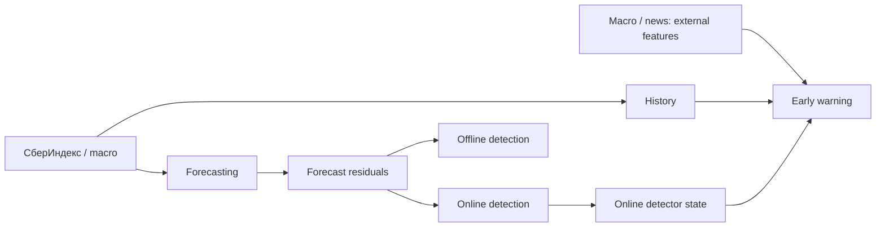
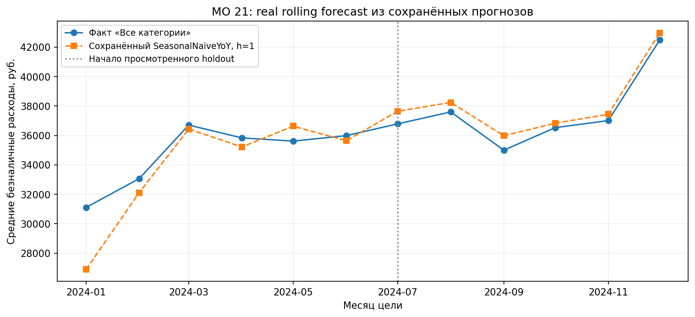

# Прогнозирование потребительских расходов и обнаружение структурных изменений

Краткая презентация на 12 слайдов. Основная история — реальные данные и forecasting; синтетические оценки обозначены отдельно.

Источники: [README](../../../README.md), [методологический отчёт](../METHODOLOGY_REPORT.md), [итоговая сводка](../RESULTS_SUMMARY.md), [JSON результатов](../results_summary.json), [manifest рисунков](../figure_manifest.csv).

## 1. Прогнозирование потребительских расходов и обнаружение структурных изменений

- Месячная муниципальная панель СберИндекса.
- Forecasting · detection · проверка возможности early warning.
- Реальные данные, диагностические сигналы и synthetic benchmark разделены.

## 2. Три разные задачи

- **Forecasting:** значение расходов через 1 / 3 / 6 / 12 календарных месяцев; оценка по MAE в рублях.
- **Detection:** обнаружение уже начавшегося устойчивого изменения ошибок прогноза. Online использует текущую и прошлую историю, offline — весь отрезок.
- **Early warning:** предупреждение до onset о событии в следующие k месяцев; event recall, ложные тревоги и lead time.
- Низкая MAE или точная ретроспективная граница сами по себе не доказывают способность предупреждать события.

Источник: методологический отчёт, §§1, 3, 7, 10.

## 3. Данные и временная оценка

- Январь 2023 — декабрь 2024: **24 месяца, 2190 МО**.
- Цель — «Все категории»: средние безналичные расходы жителей в номинальных рублях.
- Forecasting pilot: **63 оцениваемых МО из 64 выбранных**; это отдельная область от полной панели early warning.
- Rolling-origin backtest: только доступная история; validation — цели до июня 2024, holdout — июль–декабрь 2024.
- h=1/3/6: по 6 holdout origins. **h=12: одна origin**, без validation; direct-стратегии используют fallback.
- Исторические даты публикации цели не подтверждены; L=0 — допущение. Holdout уже просмотрен.

Источники: `results_summary.json → target, forecasting.records`; методологический отчёт, §§2–3, 5.

## 4. Pipeline и доступная информация

- Residuals — фактическое значение минус прогноз SeasonalNaiveYoY по доступной истории.
- Early warning получает историю, состояния online-детекторов и внешние features на дату решения.
- **Offline detection не входит в early-warning features.**
- На real data проверена достаточность данных; на synthetic — механизм при наблюдаемых предвестниках.

Источники: README, «Архитектура»; методологический отчёт, §§3, 7, 10–11.

## 5. Forecasting: сильный сезонный baseline

**REAL DATA — pilot holdout, MAE macro в рублях. Меньше — лучше.**

| Стратегия | h=1 | h=3 | h=6 | h=12 |
| --- | ---: | ---: | ---: | ---: |
| SeasonalNaive | 4175.1 | 4175.1 | 4175.1 | 4322.1 |
| SeasonalNaiveYoY | 920.7 | 1240.4 | 1906.0 | 4322.1 |
| ProphetAuto | 1868.6 | 2041.3 | 2165.8 | 3054.2 |
| ProphetYearly | 1682.3 | 1679.6 | 1937.6 | 8496.0 |
| CatBoostDirect | 986.2 | 1939.2 | 3349.5 | 4322.1† |
| LightGBMDirect | 1003.3 | 1449.8 | 2463.2 | 4322.1† |
| National/Local + CatBoost | 823.4 | 1225.7 | 2132.7 | 4322.1† |
| National/Local + LightGBM | **799.6** | **1212.7** | **1897.2** | 4322.1† |
| Chronos-2 | 1947.4 | 2526.3 | 4150.6 | 9163.5 |

- SeasonalNaiveYoY превосходит оба Prophet на сопоставимом holdout при h=1/3/6.
- National/Local + LightGBM имеет минимум среди девяти основных стратегий на h=1/3/6; на validation уступает SeasonalNaiveYoY.
- **† h=12:** SeasonalNaive fallback вместо обученного direct-прогноза; одна origin. Устойчивый победитель не установлен.
- Chronos-2: checkpoint выпущен после периода backtest; pretraining overlap не исключён.

Источник: `results_summary.json → forecasting.records`, holdout, `mae_macro`; числа округлены из полной точности до одного знака. Методологический отчёт, §5.

## 6. Один пример последовательных прогнозов

**REAL DATA — МО 21, SeasonalNaiveYoY, h=1.**

- Каждый прогноз использует только историю на своей origin.
- МО выбрано по числовому ID, без отбора по качеству. Один ряд не заменяет panel MAE.

Источник: `figure_manifest.csv`, группа 2; методологический отчёт, §5, рисунок 2.

## 7. Change-point detection: разный доступ к данным

- **Online:** CUSUM / EWMA / BOCPD — последовательное обнаружение.
- **Offline:** PELT / Binary Segmentation — ретроспективная сегментация всего отрезка.
- **REAL DATA:** alerts и breakpoints — диагностика. Независимой разметки нет; confirmed true positives не установлены.

**Метрики на рисунке относятся только к SYNTHETIC TEST: 360 устойчивых сдвигов.** Синтетика даёт известную истину; online delay и offline localisation error имеют разный смысл.

Источники: `figure_manifest.csv`, группа 3; методологический отчёт, §§7–8.

## 8. News и внешние данные: coverage ограничено

- **93 документа · 197 snapshots · 89 canonical groups.**
- **26 features + 26 missing flags**, но только **7 уникальных временных векторов**.
- Публикации допускаются по записанной политике доступности на origin; версии и дубли не считаются независимыми событиями.
- Исторических региональных/муниципальных событий нет. Национальные features, повторённые по МО, не создают независимой временной истории.
- **Покрытия недостаточно для надёжной оценки вклада news. Predictive uplift не доказан.** Устойчивый прирост от проверенных macro features также не установлен.

Источники: `results_summary.json → news, external`; методологический отчёт, §§6, 9.

## 9. Реальный early warning: данных недостаточно

**REAL DATA — проверка достаточности, без обучения классификатора.**

- **2190 МО · 73 weak events · 6 onset-дат**; это автоматические метки изменения ошибки baseline, а не подтверждённые экономические шоки.
- k=1: **14 train positives / 4 test positives**, только **1 / 2 onset-даты**. Для k=3 пригодного временного разбиения нет.

**Классификатор не обучался, качество не оценено.** Это результат проверки достаточности данных; работоспособность pipeline не даёт недостающей временной истории.

Источники: `results_summary.json → real_early_warning`; `figure_manifest.csv`, группа 7; методологический отчёт, §10.

## 10. Synthetic early warning: проверка механизма

**SYNTHETIC BENCHMARK — не оценка предсказания реальных экономических шоков.**

- S0 — постоянная вероятность; S1 — история; S2 — история + online states; S3 — также сгенерированные внешние precursor features.

- S3 на k=1 / k=3: **event recall 0.428 / 0.617**, медианный **lead time 1 / 2 месяца** среди успешных предупреждений; TEST — 180 событий.
- Наблюдаемые до onset предвестники помогают в заданном генераторе. Результат не доказывает полезность реальных news.

Источники: `results_summary.json → synthetic_early_warning`; `figure_manifest.csv`, группа 9; методологический отчёт, §11, таблица 9.

## 11. Что установлено

- Сильный сезонный baseline трудно превзойти: SeasonalNaiveYoY лучше двух Prophet на holdout h=1/3/6.
- National/Local перспективен; минимум основной holdout-таблицы на h=1/3/6 не подтверждён устойчивым преимуществом на validation.
- Chronos-2 zero-shot на holdout не улучшил сильные baselines. Checkpoint выпущен после периода backtest; pretraining overlap не исключён.
- Реальные результаты detection остаются диагностикой без независимой разметки.
- Для обучения и оценки real early warning нужны более длинная история и больше независимых onset-дат.
- Synthetic benchmark подтверждает механизм предупреждения при наблюдаемых до onset предвестниках, в пределах заданного генератора.

Источник: методологический отчёт, §12.

## 12. Ограничения и следующие шаги

**Ограничения**

- 24 месяца истории; h=12 — одна origin и direct fallback.
- Независимой разметки реальных структурных изменений нет; news coverage ограничено.
- Исторические publication vintages цели не подтверждены; holdout уже просмотрен.

**Следующие шаги**

- Более длинная история и новые периоды с заранее фиксированным протоколом.
- Опережающие финансовые индикаторы и независимая разметка событий.
- Подтверждённые даты публикации и исторические версии внешних данных.

Источники: методологический отчёт, §§12–15; [ограничения](../limitations.md). Это направления будущей работы, а не выполненные эксперименты.
