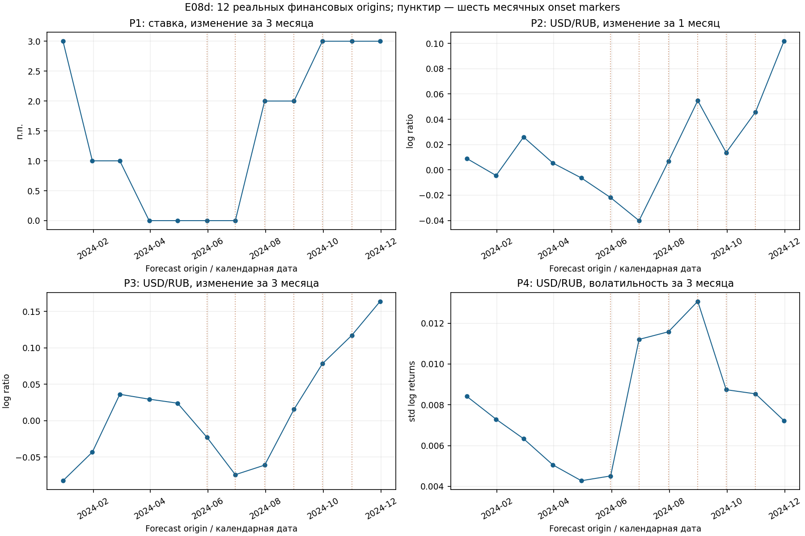
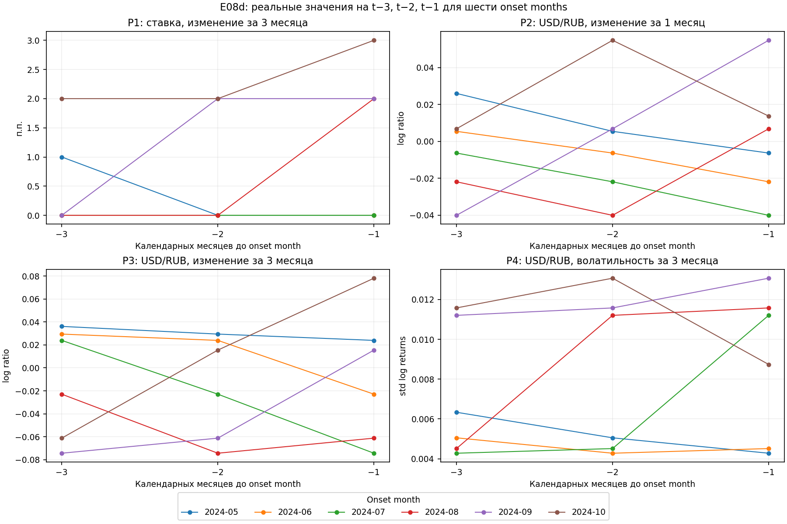

# E08d — real financial early-warning diagnostic

**NO REAL PRECURSOR EVIDENCE. E08d real financial early-warning diagnostic complete.**

На имеющейся истории основной positive-vs-negative контраст не идентифицирован: среди дат с известной меткой нет отрицательного класса. Это ограничение данных, а не доказательство отсутствия финансовых предвестников. Реальные leading financial indicators **не добавили доказательства раннего предупреждения** на этой истории.

## Источники, событие и статистическая единица

Использованы только сохранённые реальные E08b key-rate/official-USD-RUB признаки и E07b weak labels: 2190 МО, 73 weak events, 6 onset months, 71 МО с событиями и 12 forecast origins. Состав источников и SHA проверены до чтения результатов. Метки не пересобирались; synthetic data, E07c и synthetic fixtures не использовались.

Weak event — устойчивый сдвиг ошибки сохранённого причинного SeasonalNaiveYoY h=1, подтверждённый исходным трёхмесячным правилом E07. Это не независимая разметка реальных экономических shocks и не прямое определение роста/падения расходов. 73 муниципальных события не являются 73 независимыми наблюдениями национального financial signal. Единица основной оценки — уникальная calendar origin.

`onset_date` ниже — **month-end marker для onset month**, а не установленный день начала события внутри месяца. Внутримесячные даты onset неизвестны.

| onset_period | onset_date | event_count | affected_municipalities | affected_share_population |
| --- | --- | --- | --- | --- |
| 2024-05 | 2024-05-31 | 14 | 14 | 0.00639269 |
| 2024-06 | 2024-06-30 | 27 | 27 | 0.0123288 |
| 2024-07 | 2024-07-31 | 19 | 19 | 0.0086758 |
| 2024-08 | 2024-08-31 | 7 | 7 | 0.00319635 |
| 2024-09 | 2024-09-30 | 4 | 4 | 0.00182648 |
| 2024-10 | 2024-10-31 | 2 | 2 | 0.000913242 |

## Известность меток и censoring

Для каждой O сохраняется исходная causal monitoring population: eligible_at_origin и at_risk. Date-level OR положителен только при наличии хотя бы одной сохранённой fully-known positive witness. Отрицателен он только для непустой monitoring population, в которой **все** municipality labels fully-known negative. Иначе метка unknown. Unknown не заменяется нулём; retrospective regime membership не используется вместо causal active exclusion.

Исходное правило требует прошлые residual baselines и полное будущее окно до O+k+2. Dec2023…Mar2024 не становятся negative controls: прошлых residuals недостаточно. Поздние окна right-censored. Существующий event registry сам по себе не позволяет сократить этот uniform confirmation window или объявить unknown positive/negative.

| k | n_origins | n_eligible | n_positive | n_negative | n_unknown |
| --- | --- | --- | --- | --- | --- |
| 1 | 12 | 6 | 6 | 0 | 6 |
| 3 | 12 | 4 | 4 | 0 | 8 |

Здесь n_eligible означает даты с известной агрегированной меткой. Для k=1 это Apr…Sep2024, для k=3 — Apr…Jul2024; все эти даты positive. label_known_at — ретроспективная доступность outcome после confirmation window, не финансовый feature на O.

### Сохранённые origin labels, k=1

| forecast_origin | known_label_k1 | event_next_1m | event_count_next_1m | monitoring_positive_event_count_k1 | monitoring_known_municipality_count_k1 | monitoring_unknown_municipality_count_k1 | label_known_at_k1 |
| --- | --- | --- | --- | --- | --- | --- | --- |
| 2023-12-31 | нет | — | — | — | 0 | 2075 | — |
| 2024-01-31 | нет | — | — | — | 0 | 2083 | — |
| 2024-02-29 | нет | — | — | — | 0 | 2044 | — |
| 2024-03-31 | нет | — | — | — | 0 | 2053 | — |
| 2024-04-30 | да | 1 | 14 | 14 | 2023 | 31 | 2024-07-31 |
| 2024-05-31 | да | 1 | 27 | 27 | 2023 | 34 | 2024-08-31 |
| 2024-06-30 | да | 1 | 19 | 19 | 2028 | 33 | 2024-09-30 |
| 2024-07-31 | да | 1 | 7 | 7 | 2021 | 25 | 2024-10-31 |
| 2024-08-31 | да | 1 | 4 | 2 | 1995 | 27 | 2024-11-30 |
| 2024-09-30 | да | 1 | 2 | 2 | 1979 | 28 | 2024-12-31 |
| 2024-10-31 | нет | — | — | — | 0 | 2006 | — |
| 2024-11-30 | нет | — | — | — | 0 | 2012 | — |

### Сохранённые origin labels, k=3

| forecast_origin | known_label_k3 | event_next_3m | event_count_next_3m | monitoring_positive_event_count_k3 | monitoring_known_municipality_count_k3 | monitoring_unknown_municipality_count_k3 | label_known_at_k3 |
| --- | --- | --- | --- | --- | --- | --- | --- |
| 2023-12-31 | нет | — | — | — | 0 | 2075 | — |
| 2024-01-31 | нет | — | — | — | 0 | 2083 | — |
| 2024-02-29 | нет | — | — | — | 0 | 2044 | — |
| 2024-03-31 | нет | — | — | — | 0 | 2053 | — |
| 2024-04-30 | да | 1 | 60 | 60 | 2018 | 36 | 2024-09-30 |
| 2024-05-31 | да | 1 | 53 | 53 | 2022 | 35 | 2024-10-31 |
| 2024-06-30 | да | 1 | 30 | 30 | 2027 | 34 | 2024-11-30 |
| 2024-07-31 | да | 1 | 13 | 11 | 2020 | 26 | 2024-12-31 |
| 2024-08-31 | нет | — | — | — | 0 | 2022 | — |
| 2024-09-30 | нет | — | — | — | 0 | 2007 | — |
| 2024-10-31 | нет | — | — | — | 0 | 2006 | — |
| 2024-11-30 | нет | — | — | — | 0 | 2012 | — |

event_count и affected counts относятся к **наблюдаемым подтверждённым событиям полного frozen registry**, а monitoring_positive_event_count — к known-positive events внутри causal at-risk cohort. Это разные denominators. На Aug2024 origin k=1 registry count=4, monitoring count=2; на Jul2024 origin k=3 — 13 и 11: два МО уже были known-active. affected_share — описательная доля от всех 2190 МО.

Известный positive OR не означает известность точного числа событий всей monitoring population: неизвестные municipality labels остаются. event_count_complete_k1/k3 в этом запуске false и на known-positive dates. Наблюдаемые counts не заполняют unknown labels. distance_to_next_onset_months — исключительно retrospective evaluation-only поле; ни одной модели оно не передавалось.

## Заранее заданные primary diagnostics

P1 — key_rate_change_3m; P2 — usd_rub_change_1m; P3 — usd_rub_change_3m; P4 — usd_rub_vol_3m. Первые три используются со знаком; volatility уже intrinsic magnitude. Rate change измеряется в процентных пунктах; FX changes — natural-log ratios, volatility — sample std опубликованных setting log returns, ddof=1, без annualisation. Absolute magnitudes отдельно описательные, без дополнительных primary tests. Остальные шесть E08b features — secondary/descriptive only.

| diagnostic_id | feature | k | n_positive | n_negative | positive_mean | positive_median | negative_mean | negative_median | difference_in_means | difference_in_medians | rank_biserial | comparison_status |
| --- | --- | --- | --- | --- | --- | --- | --- | --- | --- | --- | --- | --- |
| P1 | key_rate_change_3m | 1 | 6 | 0 | 1.16667 | 1 | — | — | — | — | — | NONESTIMABLE_NO_NEGATIVE_DATES |
| P2 | usd_rub_change_1m | 1 | 6 | 0 | 0.00111811 | 0.000195029 | — | — | — | — | — | NONESTIMABLE_NO_NEGATIVE_DATES |
| P3 | usd_rub_change_3m | 1 | 6 | 0 | -0.00683147 | -0.00372784 | — | — | — | — | — | NONESTIMABLE_NO_NEGATIVE_DATES |
| P4 | usd_rub_vol_3m | 1 | 6 | 0 | 0.00889685 | 0.00997166 | — | — | — | — | — | NONESTIMABLE_NO_NEGATIVE_DATES |
| P1 | key_rate_change_3m | 3 | 4 | 0 | 0.5 | 0 | — | — | — | — | — | NONESTIMABLE_NO_NEGATIVE_DATES |
| P2 | usd_rub_change_1m | 3 | 4 | 0 | -0.015421 | -0.0141599 | — | — | — | — | — | NONESTIMABLE_NO_NEGATIVE_DATES |
| P3 | usd_rub_change_3m | 3 | 4 | 0 | -0.0336379 | -0.0420671 | — | — | — | — | — | NONESTIMABLE_NO_NEGATIVE_DATES |
| P4 | usd_rub_vol_3m | 3 | 4 | 0 | 0.00789271 | 0.00785794 | — | — | — | — | — | NONESTIMABLE_NO_NEGATIVE_DATES |

Positive-group summaries доступны, но при пустом negative class differences и rank-based effect size не определены. **NA не означает effect=0.** Формулы заранее заданы: Δmean = mean_positive − mean_negative; rank_biserial = (wins − losses)/(n_positive × n_negative), где wins — positive value выше negative value, losses — ниже, ties дают ноль.

### Absolute magnitude — descriptive only

| feature | role | k | n_positive | n_negative | positive_mean | positive_median | comparison_status |
| --- | --- | --- | --- | --- | --- | --- | --- |
| key_rate_delta_last | SECONDARY | 1 | 6 | 0 | 1.33333 | 1 | NONESTIMABLE_NO_NEGATIVE_DATES |
| key_rate_change_3m | PRIMARY | 1 | 6 | 0 | 1.16667 | 1 | NONESTIMABLE_NO_NEGATIVE_DATES |
| key_rate_change_6m | SECONDARY | 1 | 6 | 0 | 1.5 | 1.5 | NONESTIMABLE_NO_NEGATIVE_DATES |
| usd_rub_change_1m | PRIMARY | 1 | 6 | 0 | 0.0239342 | 0.0178025 | NONESTIMABLE_NO_NEGATIVE_DATES |
| usd_rub_change_3m | PRIMARY | 1 | 6 | 0 | 0.0459953 | 0.0425681 | NONESTIMABLE_NO_NEGATIVE_DATES |
| key_rate_delta_last | SECONDARY | 3 | 4 | 0 | 1.25 | 1 | NONESTIMABLE_NO_NEGATIVE_DATES |
| key_rate_change_3m | PRIMARY | 3 | 4 | 0 | 0.5 | 0 | NONESTIMABLE_NO_NEGATIVE_DATES |
| key_rate_change_6m | SECONDARY | 3 | 4 | 0 | 1 | 1 | NONESTIMABLE_NO_NEGATIVE_DATES |
| usd_rub_change_1m | PRIMARY | 3 | 4 | 0 | 0.0188032 | 0.014355 | NONESTIMABLE_NO_NEGATIVE_DATES |
| usd_rub_change_3m | PRIMARY | 3 | 4 | 0 | 0.0456023 | 0.0425681 | NONESTIMABLE_NO_NEGATIVE_DATES |

## Exact permutation и Holm

Планировался полный перебор fixed-positive-count assignments на уникальных датах для signed difference in means и intrinsic volatility: 4 diagnostics × 2 horizons, фиксированная Holm family из восьми гипотез. Ни municipality rows, ни отдельные муниципальные events не являются единицей перестановки. В этом запуске нет negative dates: statistic и p-values NONESTIMABLE, evaluated assignments=0. Raw/Holm p остаются NA, без подстановки p=1 и без уменьшения planned family.

Для доступного контраста two-sided inclusive tail задавался как |T_perm| ≥ |T_observed|: p = число таких assignments / число всех assignments. Observed assignment входит в полный перебор; дополнительная +1 correction не применяется. Здесь ни одна из восьми planned primary tests фактически не оценена.

| diagnostic_id | k | n_positive | n_negative | raw_exact_p | holm_adjusted_p | permutations_possible | permutations_evaluated | test_status | holm_status |
| --- | --- | --- | --- | --- | --- | --- | --- | --- | --- |
| P1 | 1 | 6 | 0 | — | — | 1 | 0 | NONESTIMABLE_NO_NEGATIVE_DATES | NONESTIMABLE_P_VALUE |
| P2 | 1 | 6 | 0 | — | — | 1 | 0 | NONESTIMABLE_NO_NEGATIVE_DATES | NONESTIMABLE_P_VALUE |
| P3 | 1 | 6 | 0 | — | — | 1 | 0 | NONESTIMABLE_NO_NEGATIVE_DATES | NONESTIMABLE_P_VALUE |
| P4 | 1 | 6 | 0 | — | — | 1 | 0 | NONESTIMABLE_NO_NEGATIVE_DATES | NONESTIMABLE_P_VALUE |
| P1 | 3 | 4 | 0 | — | — | 1 | 0 | NONESTIMABLE_NO_NEGATIVE_DATES | NONESTIMABLE_P_VALUE |
| P2 | 3 | 4 | 0 | — | — | 1 | 0 | NONESTIMABLE_NO_NEGATIVE_DATES | NONESTIMABLE_P_VALUE |
| P3 | 3 | 4 | 0 | — | — | 1 | 0 | NONESTIMABLE_NO_NEGATIVE_DATES | NONESTIMABLE_P_VALUE |
| P4 | 3 | 4 | 0 | — | — | 1 | 0 | NONESTIMABLE_NO_NEGATIVE_DATES | NONESTIMABLE_P_VALUE |

Даже при доступном контрасте exact enumeration был бы описательной permutation reference: временная exchangeability не подтверждена, финансовые ряды имеют зависимость во времени, а k=3 окна перекрываются. Точность перебора не доказывает causal interpretation или калиброванный significance/FWER. Asymptotic p-values и бинарный success gate по p<0.05 не применялись.

## Lead-time и каждый onset month

Для всех шести onset months сохранены только заранее заданные t−1/t−2/t−3. Финансовые значения на origin с unknown event label можно показать как доступные реальные измерения; это не делает такую origin отрицательным контролем или пригодной для основного сравнения.

| onset_period | event_count | affected_municipalities | forecast_origin | known_label_k1 | known_label_k3 | key_rate_change_3m | usd_rub_change_1m | usd_rub_change_3m | usd_rub_vol_3m |
| --- | --- | --- | --- | --- | --- | --- | --- | --- | --- |
| 2024-05 | 14 | 14 | 2024-04-30 | да | да | 0 | -0.00637434 | 0.0239288 | 0.00427689 |
| 2024-06 | 27 | 27 | 2024-05-31 | да | да | 0 | -0.0219455 | -0.0229267 | 0.00451119 |
| 2024-07 | 19 | 19 | 2024-06-30 | да | да | 0 | -0.0401284 | -0.0743462 | 0.0112047 |
| 2024-08 | 7 | 7 | 2024-07-31 | да | да | 2 | 0.0067644 | -0.0612074 | 0.0115781 |
| 2024-09 | 4 | 4 | 2024-08-31 | да | нет | 2 | 0.054733 | 0.0154711 | 0.0130717 |
| 2024-10 | 2 | 2 | 2024-09-30 | да | нет | 3 | 0.0136595 | 0.0780916 | 0.00873862 |

| onset_period | lead_months | forecast_origin | financial_available | known_label_k1 | known_label_k3 | previous_eligible_origin_k1 | previous_eligible_origin_k3 |
| --- | --- | --- | --- | --- | --- | --- | --- |
| 2024-05 | 1 | 2024-04-30 | да | да | да | 2024-04-30 | 2024-04-30 |
| 2024-05 | 2 | 2024-03-31 | да | нет | нет | 2024-04-30 | 2024-04-30 |
| 2024-05 | 3 | 2024-02-29 | да | нет | нет | 2024-04-30 | 2024-04-30 |
| 2024-06 | 1 | 2024-05-31 | да | да | да | 2024-05-31 | 2024-05-31 |
| 2024-06 | 2 | 2024-04-30 | да | да | да | 2024-05-31 | 2024-05-31 |
| 2024-06 | 3 | 2024-03-31 | да | нет | нет | 2024-05-31 | 2024-05-31 |
| 2024-07 | 1 | 2024-06-30 | да | да | да | 2024-06-30 | 2024-06-30 |
| 2024-07 | 2 | 2024-05-31 | да | да | да | 2024-06-30 | 2024-06-30 |
| 2024-07 | 3 | 2024-04-30 | да | да | да | 2024-06-30 | 2024-06-30 |
| 2024-08 | 1 | 2024-07-31 | да | да | да | 2024-07-31 | 2024-07-31 |
| 2024-08 | 2 | 2024-06-30 | да | да | да | 2024-07-31 | 2024-07-31 |
| 2024-08 | 3 | 2024-05-31 | да | да | да | 2024-07-31 | 2024-07-31 |
| 2024-09 | 1 | 2024-08-31 | да | да | нет | 2024-08-31 | 2024-07-31 |
| 2024-09 | 2 | 2024-07-31 | да | да | да | 2024-08-31 | 2024-07-31 |
| 2024-09 | 3 | 2024-06-30 | да | да | да | 2024-08-31 | 2024-07-31 |
| 2024-10 | 1 | 2024-09-30 | да | да | нет | 2024-09-30 | 2024-07-31 |
| 2024-10 | 2 | 2024-08-31 | да | да | нет | 2024-09-30 | 2024-07-31 |
| 2024-10 | 3 | 2024-07-31 | да | да | да | 2024-09-30 | 2024-07-31 |

- **2024-05**: 14 зарегистрированных events, 14 МО; t−1 origin 2024-04-30. P1=0; P2=-0.00637434; P3=0.0239288; P4=0.00427689. Это описание реального предшествующего financial vector. Отдельный precursor effect относительно negative controls для этой даты не идентифицирован.
- **2024-06**: 27 зарегистрированных events, 27 МО; t−1 origin 2024-05-31. P1=0; P2=-0.0219455; P3=-0.0229267; P4=0.00451119. Это описание реального предшествующего financial vector. Отдельный precursor effect относительно negative controls для этой даты не идентифицирован.
- **2024-07**: 19 зарегистрированных events, 19 МО; t−1 origin 2024-06-30. P1=0; P2=-0.0401284; P3=-0.0743462; P4=0.0112047. Это описание реального предшествующего financial vector. Отдельный precursor effect относительно negative controls для этой даты не идентифицирован.
- **2024-08**: 7 зарегистрированных events, 7 МО; t−1 origin 2024-07-31. P1=2; P2=0.0067644; P3=-0.0612074; P4=0.0115781. Это описание реального предшествующего financial vector. Отдельный precursor effect относительно negative controls для этой даты не идентифицирован.
- **2024-09**: 4 зарегистрированных events, 4 МО; t−1 origin 2024-08-31. P1=2; P2=0.054733; P3=0.0154711; P4=0.0130717. Это описание реального предшествующего financial vector. Отдельный precursor effect относительно negative controls для этой даты не идентифицирован.
- **2024-10**: 2 зарегистрированных events, 2 МО; t−1 origin 2024-09-30. P1=3; P2=0.0136595; P3=0.0780916; P4=0.00873862. Это описание реального предшествующего financial vector. Отдельный precursor effect относительно negative controls для этой даты не идентифицирован.

Знаки на t−1 различаются между onset months: P1: положительных значений 3, отрицательных 0, нулевых 3; P2: положительных значений 3, отрицательных 3, нулевых 0; P3: положительных значений 3, отрицательных 3, нулевых 0. Это описание заранее заданных signed indicators, без выбора окна/threshold. Variation volatility и совпадение отдельных extremes с отдельными events не доказывают общий precursor pattern или его устойчивость относительно controls.

## Leave-one-onset-out

Для каждого omitted onset month удаляются первоначально known windows, содержащие этот onset; оставшиеся labels сохраняются. Positive не превращаются в negative после удаления даты. REMOVED/NOOP обозначают действие с окнами, а NONESTIMABLE — доступность контраста. NOOP не подтверждает независимую устойчивость.

| omitted_onset_date | k | n_origins_removed | removed_origins | removal_status |
| --- | --- | --- | --- | --- |
| 2024-05-31 | 1 | 1 | ["2024-04-30"] | REMOVED |
| 2024-05-31 | 3 | 1 | ["2024-04-30"] | REMOVED |
| 2024-06-30 | 1 | 1 | ["2024-05-31"] | REMOVED |
| 2024-06-30 | 3 | 2 | ["2024-04-30", "2024-05-31"] | REMOVED |
| 2024-07-31 | 1 | 1 | ["2024-06-30"] | REMOVED |
| 2024-07-31 | 3 | 3 | ["2024-04-30", "2024-05-31", "2024-06-30"] | REMOVED |
| 2024-08-31 | 1 | 1 | ["2024-07-31"] | REMOVED |
| 2024-08-31 | 3 | 3 | ["2024-05-31", "2024-06-30", "2024-07-31"] | REMOVED |
| 2024-09-30 | 1 | 1 | ["2024-08-31"] | REMOVED |
| 2024-09-30 | 3 | 2 | ["2024-06-30", "2024-07-31"] | REMOVED |
| 2024-10-31 | 1 | 1 | ["2024-09-30"] | REMOVED |
| 2024-10-31 | 3 | 1 | ["2024-07-31"] | REMOVED |

Сохранено 84 primary signed/magnitude sensitivity rows. Контраст, его sign и ratio к full effect не определены при отсутствии negative class. Нельзя назвать результат устойчивым или ONE-EVENT-DRIVEN: исходный effect не оценён.

## Event intensity — descriptive only

Spearman рассчитывается на уникальных известных датах для observed registry counts/affected municipalities/share, с фильтрацией совместно конечных пар и average ranks при ties. Это small-N описание вариации интенсивности среди positive dates, а не оценка discrimination и не causal evidence. Повторения national features по МО не увеличивают N; неизвестные dates не добавляются как zero events.

| feature | k | outcome | n_dates | spearman_rho | status |
| --- | --- | --- | --- | --- | --- |
| key_rate_change_3m | 1 | event_count | 6 | -0.92582 | DESCRIPTIVE_OBSERVED_REGISTRY_INTENSITY |
| key_rate_change_3m | 1 | affected_municipality_count | 6 | -0.92582 | DESCRIPTIVE_OBSERVED_REGISTRY_INTENSITY |
| key_rate_change_3m | 1 | affected_share | 6 | -0.92582 | DESCRIPTIVE_OBSERVED_REGISTRY_INTENSITY |
| usd_rub_change_1m | 1 | event_count | 6 | -0.885714 | DESCRIPTIVE_OBSERVED_REGISTRY_INTENSITY |
| usd_rub_change_1m | 1 | affected_municipality_count | 6 | -0.885714 | DESCRIPTIVE_OBSERVED_REGISTRY_INTENSITY |
| usd_rub_change_1m | 1 | affected_share | 6 | -0.885714 | DESCRIPTIVE_OBSERVED_REGISTRY_INTENSITY |
| usd_rub_change_3m | 1 | event_count | 6 | -0.6 | DESCRIPTIVE_OBSERVED_REGISTRY_INTENSITY |
| usd_rub_change_3m | 1 | affected_municipality_count | 6 | -0.6 | DESCRIPTIVE_OBSERVED_REGISTRY_INTENSITY |
| usd_rub_change_3m | 1 | affected_share | 6 | -0.6 | DESCRIPTIVE_OBSERVED_REGISTRY_INTENSITY |
| usd_rub_vol_3m | 1 | event_count | 6 | -0.428571 | DESCRIPTIVE_OBSERVED_REGISTRY_INTENSITY |
| usd_rub_vol_3m | 1 | affected_municipality_count | 6 | -0.428571 | DESCRIPTIVE_OBSERVED_REGISTRY_INTENSITY |
| usd_rub_vol_3m | 1 | affected_share | 6 | -0.428571 | DESCRIPTIVE_OBSERVED_REGISTRY_INTENSITY |
| key_rate_change_3m | 3 | event_count | 4 | -0.774597 | DESCRIPTIVE_OBSERVED_REGISTRY_INTENSITY |
| key_rate_change_3m | 3 | affected_municipality_count | 4 | -0.774597 | DESCRIPTIVE_OBSERVED_REGISTRY_INTENSITY |
| key_rate_change_3m | 3 | affected_share | 4 | -0.774597 | DESCRIPTIVE_OBSERVED_REGISTRY_INTENSITY |
| usd_rub_change_1m | 3 | event_count | 4 | -0.2 | DESCRIPTIVE_OBSERVED_REGISTRY_INTENSITY |
| usd_rub_change_1m | 3 | affected_municipality_count | 4 | -0.2 | DESCRIPTIVE_OBSERVED_REGISTRY_INTENSITY |
| usd_rub_change_1m | 3 | affected_share | 4 | -0.2 | DESCRIPTIVE_OBSERVED_REGISTRY_INTENSITY |
| usd_rub_change_3m | 3 | event_count | 4 | 0.8 | DESCRIPTIVE_OBSERVED_REGISTRY_INTENSITY |
| usd_rub_change_3m | 3 | affected_municipality_count | 4 | 0.8 | DESCRIPTIVE_OBSERVED_REGISTRY_INTENSITY |
| usd_rub_change_3m | 3 | affected_share | 4 | 0.8 | DESCRIPTIVE_OBSERVED_REGISTRY_INTENSITY |
| usd_rub_vol_3m | 3 | event_count | 4 | -1 | DESCRIPTIVE_OBSERVED_REGISTRY_INTENSITY |
| usd_rub_vol_3m | 3 | affected_municipality_count | 4 | -1 | DESCRIPTIVE_OBSERVED_REGISTRY_INTENSITY |
| usd_rub_vol_3m | 3 | affected_share | 4 | -1 | DESCRIPTIVE_OBSERVED_REGISTRY_INTENSITY |

## Две фигуры из реальных значений



Каждая панель содержит 12 сохранённых financial values. Пунктир обозначает условные month-end onset markers; внутримесячный день события неизвестен. Линии соединяют измеренные точки, сглаживания и fitting нет.



Каждая линия показывает только три реальные предшествующие calendar origins. Окна разных onset months перекрываются; общие national observations повторяются в представлении и не считаются независимыми. Ни interpolated, ни synthetic points нет.

## Связь с E08c/E07 и вывод

E08c дал **NO STABLE FORECASTING UPLIFT**. E08d задаёт отдельный вопрос о real financial precursors перед weak-event onsets; forecasting MAE не смешивается с event-study diagnostics. Реальный E07 feasibility gate остаётся в силе: classifiers не обучались из-за недостаточного временного числа событий. Этот diagnostic не отменяет тот вывод и не доказывает real early warning.

**NO REAL PRECURSOR EVIDENCE** в этом запуске означает отсутствие установленного precursor evidence вследствие неидентифицируемого positive-vs-negative сравнения. Positive-only summaries и descriptive intensity correlation не восстанавливают контрольный класс и не позволяют выбрать evidence level по случайному signal. Это не доказательство отсутствия pattern; production-ready раннее предупреждение не установлено.

Ограничения: weak/не независимые labels; residual history начинается позже истории исходной цели; left insufficiency, right censoring и municipality gaps; L=0 и vintages цели не подтверждены; conditional official archive trust; June2024 FX methodology boundary; мало независимых календарных дат и перекрытие k=3 windows. Thresholds не подбирались, classifier-style metrics не рассчитывались.

## Проверки, артефакты и runtime

Проверены unique origins, сохранение unknown, own-origin financial source cutoffs, совпадение всех event-window values с реальной E08b matrix, неизменность входных SHA и завершённых output SHA. Независимая real-data проверка: [PASS](../../outputs/e08d_checks/independent_validation.json). Synthetic tests/benchmarks и classifier fits отсутствуют.

```powershell
.venv/Scripts/python.exe scripts/run_real_financial_early_warning.py --config configs/e08d_real_financial_early_warning.yaml --smoke
.venv/Scripts/python.exe scripts/run_real_financial_early_warning.py --config configs/e08d_real_financial_early_warning.yaml
.venv/Scripts/python.exe scripts/check_real_financial_early_warning.py --config configs/e08d_real_financial_early_warning.yaml
.\.venv\Scripts\python.exe -I -B -X utf8 outputs/e08d_checks/check_independent.py
.venv/Scripts/python.exe -B -X utf8 scripts/report_real_financial_early_warning.py
```

Runtime основного расчёта: 1.760 s. Report/figure rendering — отдельная команда, без models или изменения исходных labels.

[Run manifest](../../outputs/real_financial_early_warning_e08d_v1/run_manifest.json); [figure provenance](../../outputs/real_financial_early_warning_e08d_v1/figures/figure_manifest.json).

- [origin_event_study.csv](../../outputs/real_financial_early_warning_e08d_v1/origin_event_study.csv)
- [event_window_table.csv](../../outputs/real_financial_early_warning_e08d_v1/event_window_table.csv)
- [diagnostic_comparisons.csv](../../outputs/real_financial_early_warning_e08d_v1/diagnostic_comparisons.csv)
- [permutation_results.csv](../../outputs/real_financial_early_warning_e08d_v1/permutation_results.csv)
- [leave_one_event_out.csv](../../outputs/real_financial_early_warning_e08d_v1/leave_one_event_out.csv)
- [event_intensity.csv](../../outputs/real_financial_early_warning_e08d_v1/event_intensity.csv)
- [eligibility_summary.csv](../../outputs/real_financial_early_warning_e08d_v1/eligibility_summary.csv)

F1–F7, E08a/b/c, README, final methodology report и presentation не обновляются. Следующий шаг — отдельно решить, нужна ли дополнительная реальная история с сопоставимыми known negative dates; новые sources/models этим diagnostic не разрешаются.

REAL DATA ONLY; NO SYNTHETIC DATA; NO CLASSIFIER FITS; NO THRESHOLD TUNING; NO COMMIT/PUSH.
